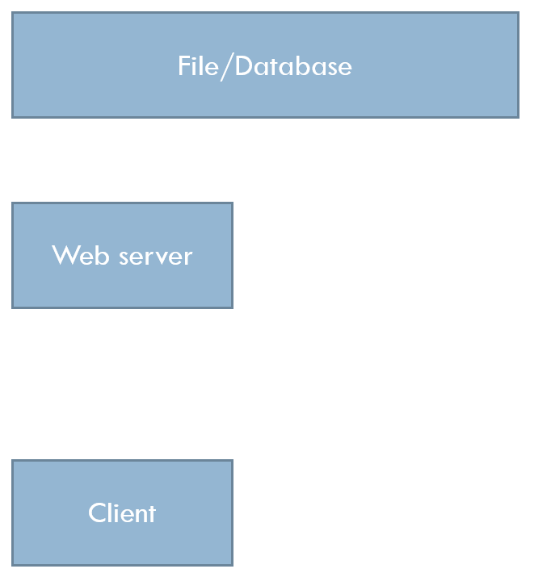

# Adattárolás (közös adat mind erőforrás megosztása)

## Szkripbeli változók

- Élettartamuk a szkript futása
- Utána megszűnnek


## Külső adattárolás


### Fájl
- Bármikor elérhető, nincs szükség plusz szoftverekre
- Könnyen értelmezhető (ember, program)
- Könnyen használható
- Viszonylag kis méretű

### Adatbázis
- Biztonságos
- Típusos adatok
- Bonyolult adatszerkezetek
- Összetett kereshetőség
- Fejlett konkurenciakezelés

# Fájlkezelés PHP-ban

## Fájlműveletek PHP-ban
- Lehetőség fájlok használatára (olvasás, írás, stb)
- A szerver helyi fájljai elérhetőek (fájlrendszer)
- Sokféle nyelvi lehetőség
- Tipikus folyamat
  - Megnyitás
  - Feldolgozás
  - Bezárás

## Alacsony szintű általános fájlműveletek
- `fopen`
- `fclose`
- `feof`
- `fread`
- `fscanf`
- `fgets`
- `fgetcsv`
- `fwrite`
- `fprintf`
- `fputcsv`

## Magas szintű fájlműveletek
- Beolvasás
  - `$array = file($filename[, $modifiers])` fájl soronként tömbbe
  - `$data = file_get_contents($filename)` egész fájl szövegként
  - `readfile($filename)` fájl kimenetre írása (pl. képek kiírása)
- Kiírás
  - `file_put_contents($filename, $data)` fájlba írás
  - `file($filename, $data)` fájlba írás soronként

## Fájlrendszer-műveletek
- `mkdir($dirname)` könyvtár létrehozása
- `rmdir($dirname)` könyvtár törlése
- `copy($source, $dest)` fájl másolása
- `rename($source, $dest)` fájl átnevezése
- `unlink($filename)` fájl törlése
- `basename($path)` fájl nevének lekérdezése
- `dirname($path)` könyvtár nevének lekérdezése
- `realpath($path)` teljes elérési út lekérdezése
- `chown($filename, $user)` fájl tulajdonosának megváltoztatása
- `chmod($filename, $mode)` fájl jogosultságainak megváltoztatása
- `chgrp($filename, $group)` fájl csoportjának megváltoztatása
- `stat($filename)` fájl tulajdonságainak lekérdezése
- `is_dir($path)` könyvtár-e
- `is_file($path)` fájl-e
- `is_readable($path)` olvasható-e
- `is_writable($path)` írható-e
- `is_link($path)` szimbolikus link-e
- `is_executable($path)` futtatható-e

## Hibakezelés
- Hiba esetén `FALSE` értékkel tér vissza
- `@` operátor: hibaüzenet kiírásának elnyomása

```php
$f = @fopen("nem_letezik.txt", "r");
if($f) {
    // feldolgozás
    fclose($f);
}
```

```php
$f = fopen("nem_letezik.txt", "r");
if(!$f) {
    // feldolgozás
    die("Hiba történt!");
}
// feldolgozás
fclose($f);
```

# Fájlszerkezet-vezérelt tárolás

## Használati esetek
- Fájl szerkezete kötött
  - mikroformátum
  - áttekintőség
  - interoperabilitás
- Magas és alacsony szintű fájlműveletek

### 1. Példa
Adott filmcímek listája egy fájéban, soronként egy filmmel. Olvassuk ezt be egy tömbbe!

```php
$films = file("list.txt", FILE_IGNORE_NEW_LINES | FILE_SKIP_EMPTY_LINES);

/*
Array
(
    [0] => The hobbit
    [1] => The lord of the Rings
    [2] => Into the wild
    [3] => The Passion of the Christ
)
*/
```
```
The hobbit
Lord of the Rings
Into the wild
The Passion of the Christ
```

#### Hibaellenőrzés
```php
// required
$films = @file('list_not_exists.txt', FILE_IGNORE_NEW_LINES | FILE_SKIP_EMPTY_LINES) or die('File not found!');
```
Vagy
```php
// Default data
$films = @file('list_not_exists.txt', FILE_IGNORE_NEW_LINES | FILE_SKIP_EMPTY_LINES)
if(!$films) {
    $films = [];
}
```

### 2. Példa
Egy filmcímeket tartalmazó tömb fájlba mentése (egy cím egy sor)
```php
// A tömb filmcímekkel
$films = [
    'Vuk',
    'Lolka és Bolka',
    'Macskafogó',
    'Kisvakond és barátai',
];

// Kiírás alacsony szintű műveletekkel
define('ENDLINE', "\n");
$f = fopen('cartoons.txt', 'w') or die('Cannot open file!');
if($f) {
    foreach($films as $film) {
        fputs($f, $film . ENDLINE);
    }
    fclose($f);
}

// VAGY
define('ENDLINE', "\n");
// Elemek összefűzése
$s = implode(ENDLINE, $films . ENDLINE);
// Kiírás magas szintű művelettel
$succes = file_put_contents('cartoons.txt', $s);
```

### 3. példa
Adott egy **rekordokból álló tömb**. Végezzük el a kiírást úgy, hogy eg ysorban egy rekordnyi információ legyen, az egyes értékeket soron belül **tabulátorral** válasszuk el.

```php
$films = [
    [
        "title" => "The Passion of the Christ",
        "director" => "Mel Gibson",
        "year" => 2004,
    ],
    [
        "title" => "Ben Hur",
        "director" => "William Wyler",
        "year" => 1959,
    ]
]

$file = @fopen("films.txt", "w");

if(!$file) {
    die("Cannot open file!");
}

foreach($films as $film) {
    fputcsv($file, $film, "\t");
}
fclose($file);
```

```
The Passion of the Christ	Mel Gibson	2004
Ben Hur William Wyler	1959
```

### 4. Példa
Az előző példában kapott fájlt olvassuk be rekordok tömbjeként!

```php
$films = [];
$file = @fopen("films.txt", "r");

if(!$file) {
    die("Cannot open file!");
}

while($row = fgetcsv($file, 0, "\t")) {
    $films[] = [
        "title" => $line[0],
        "director" => $line[1],
        "year" => $line[2],
    ];
}
fclose($file);
```

### 5. Példa
- Az előző feladatbeli rekordok tömbjét tároljuk úgy a fájlban, hogy a rekord minden egyes mezeje külön sorba kerüljön és az egyes rekordokat üres sor válassza el egymástól.
- Oldjuk meg a tömb beolvasásást is
- Alacsony szintű fájlműveletek

#### Kiírás
```php
// Mentés fájlba
define('ENDLINE', "\n");

$file = @fopen("films.txt", "w");

if(!$file) {
    die("Cannot open file!");
}
foreach($films as $film) {
    fputs($file, $film['title'] . ENDLINE);
    fputs($file, $film['director'] . ENDLINE);
    fputs($file, $film['year'] . ENDLINE);
    fputs($file, ENDLINE);
}
fclose($file);
```

#### Beolvasás
```php
$films = [];
$file = @fopen("films.txt", "r");

if(!$file) {
    die("Cannot open file!");
}

while(!feof($file)) {
    $title = trim(fgets($file));
    $director = trim(fgets($file));
    $year = trim(fgets($file));
    $empty_line = fgets($file);
    if($title != '')
    {
        $filmek[] = [
            "title" => $title,
            "director" => $director,
            "year" => $year,
        ];
    }
}
fclose($file);
```

## Konkurens fájlhasználat
Ha egyszerre többen hívják meg a szkriptet -> konkurens használat
- `flock($f, $op)
  - $op
    - `LOCK_SH` - olvasásra zár
    - 'LOCK_EX` - írásra zár
    - 'LOCK_UN` - zárolás feloldása
- `fflush($f)` - fájlpuffer ürírése

```php
$file = @fopen("films.txt", "w");
if (!$file) {
    die("Cannot open file!");
}

if(flock($file, LOCK_EX)) {
    foreach ($filmek as $film) {
        fputcsv($file, $film, "\t");
    }
    fflush($file);
    flock($file, LOCK_UN);
}
fclose($file);
```

Olvasáshoz is érdemes lockolni a fájlt, hogy közben ne kezdődhessen el egy írási folyamat

```php
$films = [];
$file = @fopen("films.txt", "r");

if(!$file) {
    die("Cannot open file!");
}

if(flock($file, LOCK_SH)) {
    while($row = fgetcsv($file, 0, "\t")) {
        $films[] = [
            "title" => $line[0],
            "director" => $line[1],
            "year" => $line[2],
        ];
    }
    flock($file, LOCK_UN);
}
fclose($file);
```

# Adatszerkezet-vezérelt tárolás
## Adatszerkezet
- Adatszerkezet mentése és betöltése
- Fájl tartalma nem érdekes
- Az adat rendelkezésre állása az érdekes
- Adatszerkezet -> szöveges formátum
- -> Sorosítás + magas szintű fájlműveletek

## Sorosítás
- Egy adatszerkezete visszaalakítható szöveges megfelelője
- Használata
  - tárolás
  - átküldés
- Sorosító függvények
  - `serialize($data)` - adatszerkezet szöveges megfelelőjének előállítása
  - `unserialize($data)` - szöveges megfelelőből adatszerkezet előállítása
  - `json_encode($data)` - adatszerkezet szöveges megfelelőjének előállítása
  - `json_decode($data)` - szöveges megfelelőből adatszerkezet előállítása

### Példa
```php
$filmek = [
    [
        "title" => "The Passion of the Christ",
        "director" => "Mel Gibson",
        "year" => 2004,
    ],
    [
        "title" => "Ben Hur",
        "director" => "William Wyler",
        "year" => 1959,
    ],
];
```

#### `sreialize`, `unserialize`
```php
$data = serialize($filmek);
// a:2:{i:0;a:3:{s:5:"title";s:25:"The Passion of the Christ";s:8:"director";s:10:"Mel Gibson";s:4:"year";i:2004;}i:1;a:3:{s:5:"title";s:6:"Ben Hur";s:8:"director";s:13:"William Wyler";s:4:"year";i:1959;}}
$filmek2 = unserialize($data);
/*
array(2) {
  [0]=>
  array(3) {
    ["title"]=>
    string(25) "The Passion of the Christ"
    ["director"]=>
    string(10) "Mel Gibson"
    ["year"]=>
    int(2004)
  }
  [1]=>
  array(3) {
    ["title"]=>
    string(6) "Ben Hur"
    ["director"]=>
    string(13) "William Wyler"
    ["year"]=>
    int(1959)
  }
}
*/
```

#### `json_encode`, `json_decode`
```php
$data = json_encode($filmek, JSON_PRETTY_PRINT);
/*
[
    {
        "title": "The Passion of the Christ",
        "director": "Mel Gibson",
        "year": 2004
    },
    {
        "title": "Ben Hur",
        "director": "William Wyler",
        "year": 1959
    }
]
*/
$filmek2 = json_decode($data, true);
/*
array(2) {
  [0]=>
  array(3) {
    ["title"]=>
    string(25) "The Passion of the Christ"
    ["director"]=>
    string(10) "Mel Gibson"
    ["year"]=>
    int(2004)
  }
  [1]=>
  array(3) {
    ["title"]=>
    string(6) "Ben Hur"
    ["director"]=>
    string(13) "William Wyler"
    ["year"]=>
    int(1959)
  }
}
*/
$filmek3 = json_decode($data, false);
/*
object(stdClass)#1 (2) {
  [0]=>
  object(stdClass)#2 (3) {
    ["title"]=>
    string(25) "The Passion of the Christ"
    ["director"]=>
    string(10) "Mel Gibson"
    ["year"]=>
    int(2004)
  }
  [1]=>
  object(stdClass)#3 (3) {
    ["title"]=>
    string(6) "Ben Hur"
    ["director"]=>
    string(13) "William Wyler"
    ["year"]=>
    int(1959)
  }
}
*/
```

## Segédfüggvények
Akármelyik adatszerkezetre működik, de típusinfomációk elveszhetnek!
```php
function load_from_file($filename, $default_data = [])
{
    $data = @file_get_contents($filename);
    return ($data === false ? $default_data : json_decode($data, true));
}

function save_to_file($filename, $data)
{
    $file_data = json_encode($filename, $data) {
        $file_data = json_encode($data);
        return file_put_contents($filename, $file_data, LOCK_EX);
    }
}
```

### Példa - új film hozzáadása
```php
const FILMS_DATAFILE = "films.json";
$films = load_from_file(FILMS_DATAFILE);
$films[] = [
    "title" => "Braveheart",
    "director" => "Mel Gibson",
    "year" => 1995,
];
save_to_file(FILMS_DATAFILE, $films);
```

### Hátrányok
- Sok adat mozgatása
- Rossz konkurrencia-kezelés
- Manuális szűrés

# Segédosztályok

## Elvárások
Egy olyan interfész kialakítása, amivel
- az adatok kezelése egyszerű
- magas szintű műveletekkel
- adattárolás módja el van rejtve
- működik tömbökkel és objektumokkal is

### Példa
Jelenítsük meg a filmeket felsorolásban! A lista fölött szűrőmező
```php
<?php
//Data
function getMoviesByYear(int $year = NULL) : array {
    // ...
}
//Main
$year = (int)$_GET["year_filter"] ?? NULL;

$movies = getMoviesByYear($year);
?>
<h1>Filmek</h1>
<form action="">
    <input name="year_filter">
    <button>Szűrés</button>
</form>
<ul>
    <?php foreach ($movies as $movie) : ?>
        <li>
            <?= $movie["title"] ?> 
            (<?= $movie["year"] ?>)
        </li>
    <?php endforeach; ?>
</ul>
```

## I/O absztrakciók: `JsonIO`, `serializeIO`
```php
interface IFileIO {
    function save($data);
    function load();
}

abstract class FileIO implements IFileIO {
    protected $filepath;

    public function __construct($filename) {
        if(!is_readable($filename) || !is_writable($filename)) {
            throw new Exception("File not readable or writable");
        }
        $this->filepath = realpath($filename);
    }
}

class JsonIO extends FileIO {
    public function load($assoc = true) {
        $file_content = file_get_contents($this->filepath);
        retrun json_decode($file_content, $assoc) ?: [];
    }

    public function save($data) {
        $json_content = json_encode($data, JSON_PRETTY_PRINT);
        return file_put_contents($this->filepath, $json_content);
    }
}

class SerializeIO extends FileIO {
    public function load(){
        $file_content = file_get_contents($this->filepath);
        return unserialize($file_content) ?: [];
    }

    public function save($data){
        $serialized_content = serialize($data);
        file_put_contents($this->filepath, $serialized_content);
    }
}
```

### Használat
```php
$io = new JsonIO("movies.json");

$movies = $io->load();
$movies[] = [
    "title" => "Avatar",
    "director" => "James Cameron",
    "year" => 2009,
];
$io->save($movies);
```

```php
function getMoviesByYear(int $year = NULL) : array {
    $io = new JsonIO("movies.json");
    $movies = $io->load();
    return array_filter($movies, function($movie) use ($year) {
        return $movie["year"] == $year;
    });
}
```

### Adatstruktúra
```php
// movies.json
[
    {
        "id": "1",
        "title": "The Passion of the Christ",
        "year": 2004
        "director": "Mel Gibson",
    },
    {
        "id": "2",
        "title": "Risen",
        "year": 2016
        "director": "Kevin Reynolds",
    }
]
```
```php
// PHP Data
[
    [
        "id" => "1",
        "title" => "The Passion of the Christ",
        "year" => 2004
        "director" => "Mel Gibson",
    ],
    [
        "id" => "2",
        "title" => "Risen",
        "year" => 2016
        "director" => "Kevin Reynolds",
    ]
]
```

## IStorage interfész
```php
interface IStorage {
    function add($record): string;
    function findbyId(string $id): array;
    function findAll(array $params=[]): array;
    function findone(array $params=[]): array;
    function update(string $id, $record): bool;
    function delete(string $id): bool;

    function findmany(callable $condition): array;
    function updateMany(callable $condition, callable $updater): bool;
    function deleteMany(callable $condition): bool;
}
```

## Storage
Tömbön és objektumon működik
```php
class Storage implements IStorage {
  protected $contents;
  protected $io;

  public function __construct(IFileIO $io, $assoc = true) {
    $this->io = $io;
    $this->contents = (array)$this->io->load($assoc);
  }

  public function __destruct() {
    $this->io->save($this->contents);
  }

  public function add($record): string {
    $id = uniqid();
    if (is_array($record)) {
      $record['id'] = $id;
    }
    else if (is_object($record)) {
      $record->id = $id;
    }
    $this->contents[$id] = $record;
    return $id;
  }

  public function findById(string $id) {
    return $this->contents[$id] ?? NULL;
  }

  public function findAll(array $params = []) {
    return array_filter($this->contents, function ($item) use ($params) {
      foreach ($params as $key => $value) {
        if (((array)$item)[$key] !== $value) {
          return FALSE;
        }
      }
      return TRUE;
    });
  }

  public function findOne(array $params = []) {
    $found_items = $this->findAll($params);
    $first_index = array_keys($found_items)[0] ?? NULL;
    return $found_items[$first_index] ?? NULL;
  }

  public function update(string $id, $record) {
    $this->contents[$id] = $record;
  }

  public function delete(string $id) {
    unset($this->contents[$id]);
  }

  public function findMany(callable $condition) {
    return array_filter($this->contents, $condition);
  }

  public function updateMany(callable $condition, callable $updater) {
    array_walk($this->contents, function (&$item) use ($condition, $updater) {
      if ($condition($item)) {
        $updater($item);
      }
    });
  }

  public function deleteMany(callable $condition) {
    $this->contents = array_filter($this->contents, function ($item) use ($condition) {
      return !$condition($item);
    });
  }
}
```

### Használat (Tömb)
```php
$movieStorage = new Storage(new JsonIO('movies.json'));
// Create
$id = $movieStorage->add([
  'title' => 'God\'s Not Dead',
  'director' => 'Harold Cronk',
  'year'  => 2014,
]);
// Read
print_r($movieStorage->findAll());
print_r($movieStorage->findOne(['title' => 'Avatar']));
print_r($movieStorage->findById('1'));
print_r($movieStorage->findMany(function ($movie) {
  return $movie['age'] >= 30;
}));
// Update
$movie = $movieStorage->findById($id);
$movie['year'] = 2016;
$movieStorage->update($id, $movie);
// Delete
$movieStorage->delete('2');
```

### Használat (Objektum)
```php
class Movie {
  public $id = NULL;
  public $title = NULL;
  public $year = NULL;
  public $director = NULL;

  public function __construct($title = NULL, $year = NULL, $director = NULL) {
    $this->title = $title;
    $this->year = $year;
    $this->director = $director;
  }
}
```
```php
$movieStorage = new Storage(new SerializeIO('movies.txt'));
// Create
$id = $movieStorage->add(
  new Movie('God\'s not dead', 2014, 'Harold Cronk'));
// Read
print_r($movieStorage->findAll());
// Update
$movie = $movieStorage->findById($id);
$movie->year = 2016;
$movieStorage->update($id, $movie);
// Delete
$movieStorage->delete($id);$movieStorage = new Storage(new SerializeIO('movies.txt'));
// Create
$id = $movieStorage->add(
  new Movie('God\'s not dead', 2014, 'Harold Cronk'));
// Read
print_r($movieStorage->findAll());
// Update
$movie = $movieStorage->findById($id);
$movie->year = 2016;
$movieStorage->update($id, $movie);
// Delete
$movieStorage->delete($id);
```

## Domain Storage
```php
function getMoviesByYear(int $year = NULL): array {
  $movieStorage = new Storage(new JsonIO('movies.json'));
  return $movieStorage->findAll(['year' => $year]);
}
// INSTEAD
$movieStorage = new MovieStorage();
$movies = $movieStorage->getMoviesByYear(2016);
```

```php
class MovieStorage extends Storage {
  public function __construct() {
    parent::__construct(new JsonIO('movies.json'));
  }
  public function getMoviesByYear($year) {
    return $this->findAll([
      "year" => $year
    ]);
  }
}
```