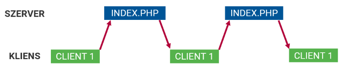
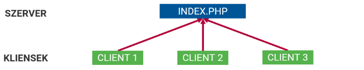
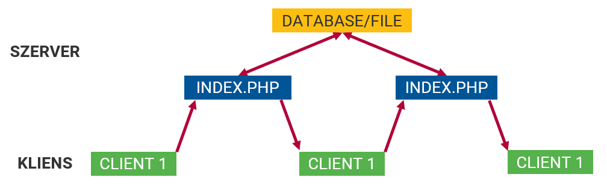
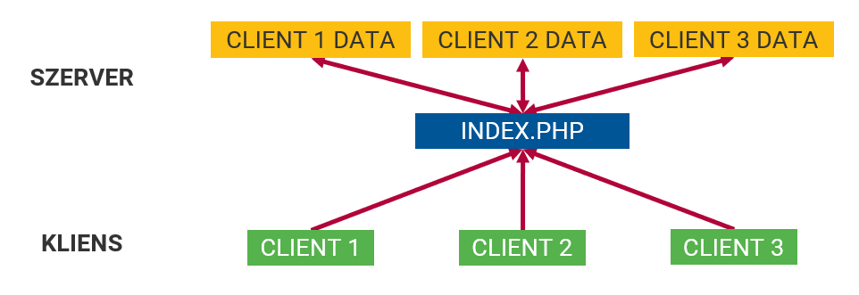
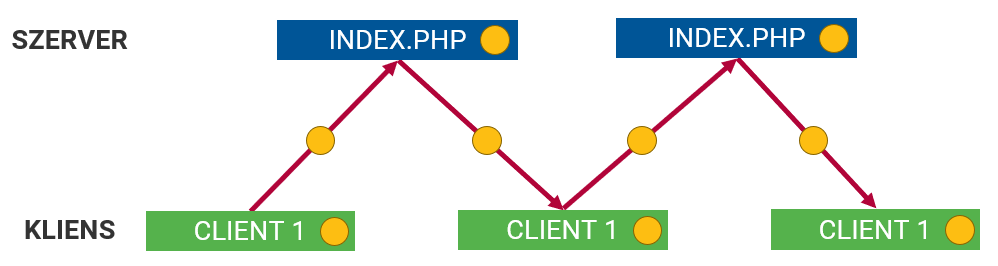
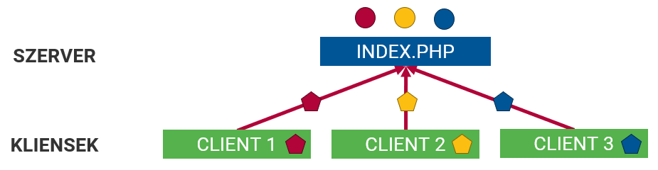
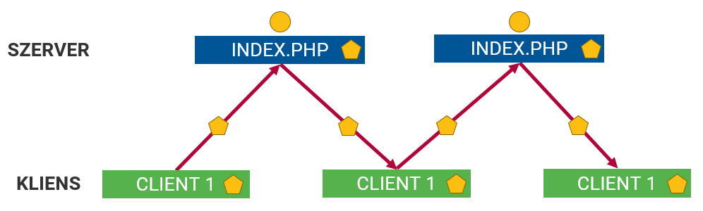

# Munkamenet-kezelés

## HTTP állapotmentesség

- A HTTP állapotmentes protokoll
- Nem emlékezik az előző kérés adataira
- Függetlenül kezeli a kéréseket
  - Ugyanazon kliens különböző kéréseit
  - Különböző kliensek kéréseit




## 1. probléma
- Ugyanazon kliens több kérése között az állapot megtartása
- Pl. kosár
- Megoldás: HTTP kéréstől külön tárolni



## 2. probléma
Mindegyik kliens ugyanazon az adaton osztozkodik

**Munkamenet-kezelés**: Kliensenkénti adattárolás



## Munkamenet-kezelés
- Kliensek megkülönböztetése
- Kliensenkénti adattárolás
- Példák:
  - levelezés, dokumentumok
  - internetbank
  - webáruház kosara, online szerkesztők
- Megoldás
  - kliens oldalon
  - szerver oldalon

# Munkaemenet-kezelési lehetőségek

Példa: Tároljuk egy számláló értékét felhasználónként, és minden kérésnél növeljük a számláló értékét eggyel.

## 1. Ötlet: Kliensoldali állapottartás
- Az adatot a kliens tárolja
- Minden kérésnél elküldi a szervernek
- A szerver visszaadja a kliensnek
- Kliensoldali technológiák
  - URL
  - Rejtett mező
  - Süti



### 1/1: URL
- Hátránya:
  - Minden linkhez oda kell generálni (Ha egyről is lemarad, elvész az adat)
  - Sok adat nem fér el benne (URL hossza limitált)
  - Feltűnő (zavaró)
  - Könnyen átírható
- Előny:
  - Könyvjelzőzhető
```
session_url.php?counter=1
```
```php
<?php
$counter = $_GET['counter'] ?? 0;
$counter++;
?>
Counter value: <?= $counter ?> <br>
<a href="session_url.php?counter=<?= $counter ?>">Increment</a>
```
  
### 1/2: Rejtett mező
- URL: kevés adat, feltűnő, manipulálható
- -> űrlap rejtett mezője
```html
<input type="hidden" name="counter" value="4">
```
- Előny:
  - Nem látszik a felhasználónak
  - Sok adat fér el benne
- Hátrány:
  - manipulálható
  - csak űrlapokon használható
  - normál linkeknél JavaScript kell

```php
<?php 
$counter = $_POST['counter'] ?? 0;
$counter++;
?>
Counter value: <?= $counter ?> <br>
<form action="" method="post">
    <input type="hidden" name="counter" value="<?= $counter ?>">
    <input type="submit" value="Increment">
</form>

<a href="session_hidden.php>Increment (not working)</a>
```

### 1/3: Süti
- Rejtett mező: macerás, manipulálható -> Süti

HTTP kérés és PHP (`$_COOKIES`):
```http
Cookie: név1=érték1; név2:érték2; név3:érték3
```
HTTP válasz és PHP (`setcookie()`):
```http
Set-Cookie: név=érték[; expires=dátum][; domain=domain][;path=path][; secure]
```
```php
setcookie("foo", "bar");
setcookie("foo", "bar", time() + 60);
```

**Süti**
```php
<?php
$counter = $_COOKIE['counter'] ?? 0;
$counter++;
setcookie('counter', $counter);
?>
Counter value: <?= $counter ?> <br>
<a href="session_cookie.php">Increment</a>
```

- Előnyök
  - nem feltűnő
  - automatikus küldés
- Hátrány
  - manipulálható
  - limitált adatmennyiség
  - letiltható

## Kliensoldali megoldások összefoglalva
- Adat a kliensen van
- **Manipulálható**
- Sok adat esetén feleslegesen sok adat megy oda-vissza a kliens és szerver között


## 2. Ötlet: Szerveroldali megoldások
- Tároljuk az adatot a szerveren
  - Nem manipulálható kliens oldalon
  - Nem kell sok adatot küldözgetni
- A kliens megkülönböztetése továbbra is szükséges
- **tokent** kap, amivel azonosítja magát
- hozzáfér a **tokenhez** tartozó adatokhoz
- Token kliensoldali megoldással közlekedik
  - süti (alapértelmezett)
  - URL (ha nincs süti)

**Több kliens**


**Egy kliens különböző kérései**


- Adatok tárolása
  - fájlban
  - adatbázisban
- Plusz erőforrás a szervertől
- A tokenre nagyon kell vigyázni!
  - ellopható
  - kilépés

# Munkamenet-kezelés PHP-ban

- Munkamenethez tartozó adatok:
  - `$_SESSION`
- Munkamenet kezelő függvények:
  - `session_start()`
  - `session_destroy()`
  - `session_regenerate_id()` (token újragenerálása)
- Gyakorlati oldalról: klienshez tartozó változó, ami megőrzi az értékét az újratöltések között is

## Példa: számláló
```php
<?php
session_start();
$counter = $_SESSION['counter'] ?? 0;
$counter++;
$_SESSION['counter'] = $counter;
?>
Counter value: <?= $counter ?> <br>
<a href="session.php">Increment</a>
```

## Munkamenet megszűntetése
```php
session_start();
$_SESSION = [];
session_destroy();
```

# Hitelesítés és jogosultságkezelés

## Azonosítás (authentication)
- Ki használja az alkalmazást?
  - azonosított felhasználó
    - felhasználónév, stb..
  - névtelen felhasználó
    - vendég

## Jogosultságkezelés (authorization)
- Engedélyezett-e a hozzáférése az adott felhasználónak?
- Bizonyos oldalak, funkciók csak azonosított felhasználók számára érhetők el

## Technológiák
- `.htaccess`, `.htpasswd` fájl
  - Könyvtár alapú védelem
  - Apache webszerveren
- WWW-Authenticate
  - HTTP protkoll
  - Módok: basic, digest (titkosított)
  - PHP-ból kiolvasható
- Ezek PHP-tól független technológiák
- Plusz adat tárolására nem alkalmasak
- Csak hitelesítésre

## Hitelesítés munkamenettel
- Azonosított felhasználó munkamenetében egy speciális kulcsot helyezünk el
- Ezzel jelezzük, hogy már azonosítottuk
- Folyamat
  - beléptető űrlap
  - sikeres belépés esetén -> kulcs
  - minden oldalon: ha ez a kulcs megvan, akkor azonosított
  - ettől függően más logika, más nézet lehet

## Átirányítás (segédfüggvény)
```php
function redirect($page) {
    header("Location: $page");
    exit;
}
```

## Felhasználók tárolása
```php
class UserStorage extends Storage {
    public function __construct() {
        parent::__construct(new JsonIO('users.json'));
    }
}
```

## Regisztráció (űrlap)
```php
<?php if (isset($errors['global'])) : ?>
  <p><span class="error"><?= $errors['global'] ?></span></p>
<?php endif; ?>
<form action="" method="post">
  <div>
    <label for="username">Username: </label><br>
    <input type="text" name="username" id="username" value="<?= $_POST['username'] ?? "" ?>">
    <?php if (isset($errors['username'])) : ?>
      <span class="error"><?= $errors['username'] ?></span>
    <?php endif; ?>
  </div>
  <div>
    <label for="password">Password: </label><br>
    <input type="password" name="password" id="password">
    <?php if (isset($errors['password'])) : ?>
      <span class="error"><?= $errors['password'] ?></span>
    <?php endif; ?>
  </div>
  <div>
    <label for="fullname">Full name: </label><br>
    <input type="text" name="fullname" id="fullname" value="<?= $_POST['fullname'] ?? "" ?>">
    <?php if (isset($errors['fullname'])) : ?>
      <span class="error"><?= $errors['fullname'] ?></span>
    <?php endif; ?>
  </div>
  <div>
    <button type="submit">Register</button>
  </div>
</form>
```

## Regisztráció (PHP)
```php
include('userstorage.php');

// functions
function validate($post, &$data, &$errors) {
  // username, password, fullname are not empty
  // ...
  $data = $post;
  return count($errors) === 0;
}
function user_exists($user_storage, $username) {
  $users = $user_storage->findOne(['username' => $username]);
  return !is_null($users);
}
function add_user($user_storage, $data) {
  $user = [
    'username'  => $data['username'],
    'password'  => password_hash($data['password'], PASSWORD_DEFAULT),
    'fullname'  => $data['fullname'],
  ];
  return $user_storage->add($user);
}

// main
$user_storage = new UserStorage();
$errors = [];
$data = [];
if (count($_POST) > 0) {
  if (validate($_POST, $data, $errors)) {
    if (user_exists($user_storage, $data['username'])) {
      $errors['global'] = "User already exists";
    } else {
      add_user($user_storage, $data);
      redirect('login.php');
    } 
  }
}
```

## Belépés (űrlap)
```php
<?php if (isset($errors['global'])) : ?>
  <p><span class="error"><?= $errors['global'] ?></span></p>
<?php endif; ?>
<form action="" method="post">
  <div>
    <label for="username">Username: </label><br>
    <input type="text" name="username" id="username" value="<?= $_POST['username'] ?? "" ?>">
    <?php if (isset($errors['username'])) : ?>
      <span class="error"><?= $errors['username'] ?></span>
    <?php endif; ?>
  </div>
  <div>
    <label for="password">Password: </label><br>
    <input type="password" name="password" id="password">
    <?php if (isset($errors['password'])) : ?>
      <span class="error"><?= $errors['password'] ?></span>
    <?php endif; ?>
  </div>
  <div>
    <button type="submit">Login</button>
  </div>
</form>
```

## Belépés (PHP)
```php
include('userstorage.php');

// functions
function redirect($page) {
  header("Location: ${page}");
  exit();
}
function validate($post, &$data, &$errors) {
  // username, password not empty
  // ...
  $data = $post;

  return count($errors) === 0;
}
function check_user($user_storage, $username, $password) {
  $users = $user_storage->findMany(function ($user) use ($username, $password) {
    return $user["username"] === $username && 
           password_verify($password, $user["password"]);
  });
  return count($users) === 1 ? array_shift($users) : NULL;
}
function login($user) {
  $_SESSION["user"] = $user;
}

// main
session_start();
$user_storage = new UserStorage();
$data = [];
$errors = [];
if ($_POST) {
  if (validate($_POST, $data, $errors)) {
    $logged_in_user = check_user($user_storage, $data['username'], $data['password']);
    if (!$logged_in_user) {
      $errors['global'] = "Login error";
    } else {
      login($logged_in_user);
      redirect('index.php');
    }
  }
}
```

## Jogosultságkezelés (authorization)
- Többféle modell létezik
  - Csak azt nézzük be van-e lépve
  - Felhasználói azonosító alapján
  - Egyedi jogosultságok erőforrásokhoz
  - Szerepkörök alapján (RBAC - Role-based access control)

1. Munkamenet indítása
2. Van-e bejelentkezett felhasználó
3. A bejelentkezett felhasználónak van-e jogosultsága

```php
session_start();

function authorize() {
    return isset($_SESSION['user']);
}
// OR
function authorize($required_role) {
    return isset($_SESSION['user']) && in_array($required_role, $_SESSION['user']['roles']);
}
```

## Kijelentkezés
- Kulcs kivétele a munkamanetből
- Általában az egész munkamenet megszűntetése (feladatfüggő)

```php
function logout() {
    unset($_SESSION['user']);
}
```

## Egyszerűsített jogousultságvizsgálat (példa)
```php
session_start();
if(!authorize()) {
    redirect('login.php');
}
```

## Segédosztály: auth
```php
class Auth {
  private $user_storage;
  private $user = NULL;

  public function __construct(IStorage $user_storage) {
    $this->user_storage = $user_storage;

    if (isset($_SESSION["user"])) {
      $this->user = $_SESSION["user"];
    }
  }

  public function register($data) {
    $user = [
      'username'  => $data['username'],
      'password'  => password_hash($data['password'], PASSWORD_DEFAULT),
      'fullname'  => $data['fullname'],
      "roles"     => ["user"],
    ];
    return $this->user_storage->add($user);
  }

  public function user_exists($username) {
    $users = $this->user_storage->findOne(['username' => $username]);
    return !is_null($users);
  }

  public function authenticate($username, $password) {
    $users = $this->user_storage->findMany(function ($user) use ($username, $password) {
      return $user["username"] === $username && 
             password_verify($password, $user["password"]);
    });
    return count($users) === 1 ? array_shift($users) : NULL;
  }
  
  public function is_authenticated() {
    return !is_null($this->user);
  }

  public function authorize($roles = []) {
    if (!$this->is_authenticated()) {
      return FALSE;
    }
    foreach ($roles as $role) {
      if (in_array($role, $this->user["roles"])) {
        return TRUE;
      }
    }
    return FALSE;
  }

  public function login($user) {
    $this->user = $user;
    $_SESSION["user"] = $user;
  }

  public function logout() {
    $this->user = NULL;
    unset($_SESSION["user"]);
  }

  public function authenticated_user() {
    return $this->user;
  }
}
```

### Segédosztály használata (regisztráció)
```php
include('auth.php');

// functions
function validate($post, &$data, &$errors) {
  // username, password, fullname are not empty
  // ...
  $data = $post;

  return count($errors) === 0;
}

// main
$user_storage = new UserStorage();
$auth = new Auth($user_storage);
$errors = [];
$data = [];
if (count($_POST) > 0) {
  if (validate($_POST, $data, $errors)) {
    if ($auth->user_exists($data['username'])) {
      $errors['global'] = "User already exists";
    } else {
      $auth->register($data);
      redirect('login.php');
    } 
  }
}
```

### Segédosztály használata (beléptetés)
```php
include('auth.php');

// functions
function validate($post, &$data, &$errors) {
  // username, password not empty
  // ...
  $data = $post;

  return count($errors) === 0;
}

// main
session_start();
$user_storage = new UserStorage();
$auth = new Auth($user_storage);
$data = [];
$errors = [];
if ($_POST) {
  if (validate($_POST, $data, $errors)) {
    $auth_user = $auth->authenticate($data['username'], $data['password']);
    if (!$auth_user) {
      $errors['global'] = "Login error";
    } else {
      $auth->login($auth_user);
      redirect('index.php');
    }
  }
}
```

### Segédosztály használata (jogosultság elleőrzése)
```php
session_start();
$user_storage = new UserStorage();
$auth = new Auth($user_storage);

if (!$auth->is_authenticated()) {
  redirect('login.php');
}
$user = $auth->authenticated_user();
```
```php
session_start();
$user_storage = new UserStorage();
$auth = new Auth($user_storage);

if (!$user_storage->authorize(["admin"])) {
  redirect("login.php");
};
$user = $auth->authenticated_user();
```

# Fájlfeltöltés

## Űrlap és feldolgozás
```html
<form action="" method="post" enctype="multipart/form-data">
  <input type="file" name="file">
  <button>Upload</button>
</form>
<?php var_dump($errors); ?>
```
```php
$errors = [];
if ($_FILES) {
  if (array_key_exists("file", $_FILES) &&
      $_FILES["file"]["error"] == 0) {

    $from = $_FILES["file"]["tmp_name"];
    $to = "files/" . $_FILES["file"]["name"];
    move_uploaded_file($from, $to); 
  } else {
    $errors[] = "Error during upload!";
  }
}
```

## $_FILES tömb
```php
Array
(
    [file] => Array
        (
            [name] => 2019-10-01_10-00-00.png
            [type] => image/png
            [tmp_name] => /tmp/phpXZ0XZT
            [error] => 0
            [size] => 12345
        )
)
```

## Könytárlista
```php
<?php
$files = scandir("files");
<ul>
  <?php foreach ($files as $file): ?>
    <li><?= $file ?></a></li>
  <?php endforeach; ?>
</ul>
?>
```

# Hasznos függvények

## Szövegműveletek
- szöveg: karakterek tömbje
- `explode($separator, $string)` - szöveg tömbbé alakítása
- `implode($separator, $array)` - összefűzés
- `substr($string, $start, $length)` - részszöveg
- `ltrim($s), rtrim($s), trim($s)` - szóközök levágása
- `strstr($haystack, $needle)` - részszöveg keresése
- `strpos($haystack, $needle)` - részszöveg keresése
- `strrpos($haystack, $needle)` - részszöveg keresése
- `preg_match($pattern, $subject)` - reguláris kifejezés

## Dátum és idő
- `date($format)` - Az aktuális dátum és idő a megadott formátumban
- `time()` - Az aktuális időbélyeg (UNIX timestamp)
- `strtotime($string)` - Szövegből időbélyeg
- `getdate($timestamp)` - dátuminformációk visszaadása tömbként
- `date_*()` - dátummal kapcsolatos további függvények
- `DateTime` - dátum és idő kezelésére szolgáló osztály
- `DateInterval` - időintervallumok kezelésére szolgáló osztály
- `DatePeriod` - időintervallumok kezelésére szolgáló osztály

```php
date("Y:m:d G:i:s"); // 2019:11:24 17:18:59
time(); // 1574615959 (s)
strtotime('2019-12-12'); // 1576108800
strtotime('2019-12-12T12:34:12'); // 1576154052
strtotime('now'); // 1574616109
strtotime('last day of next month'); // 1577813072

$d1 = new DateTime('+2 days');
$d2 = new DateTime('-2 weeks');
$interval = $d1->diff($d2);
$interval->format('%R%a days'); // -16 days

$d1 = new DateTimeImmutable('+2 days');
$d2 = $d1->add(new DateInterval('P2Y4DT6H8M'));
$interval = $d2->diff($d1);
$interval->format('%R%a days'); // -735 days
```

## HTTP fejlécek
- `header()`
  - HTTP fejlécek leküldése
  - Pl.: `header("Location: index.php");`
    - átirányítás másik oldalra

## Külön fájlba helyezés
- Funkcionálisan elváló részeket külön fájlokban tárolni
  - átláthatóság
- Fájlok beemelése
  - `include($fájlnév)` - hiba esetén `warning`-al továbbmegy
  - `include_once($fájlnév)`
  - `require($fájlnév)` - hiba esetén `fatal error`-t dob
  - `require_once($fájlnév)`
- Mintha oda lenne másolva a kód
  
# Fejlesztői környezet
- Szerver oldalon
  - webszerver
  - PHP
- Kliens oldalon
  - böngésző
- Fejlesztői környezet
  - Szerkesztő program, (HTML, PHP, CSS)
  - SFTP, SCP kliens az állományok webszerverre töltéséhez.

## Otthoni fejlesztéshez
- PHP fejlesztői szerver:
  - `php -S localhost:8000`
- XAMPP
- Bitnami stacks
  - WAMP, LAMP, MAMP