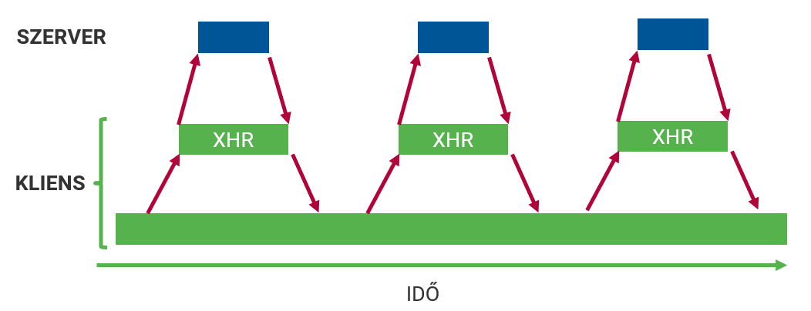
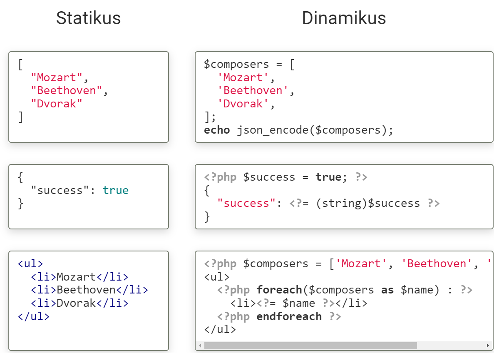
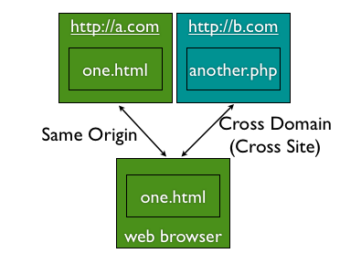

# AJAX

- HTTP kérés JavaScript-ben
- Oldalújratöltés nélkül
- A háttérben


## Kliens - XMLHTTPREQUEST
```js
const APIKEY = '...';
function getPoster() {
    const title = input.value
    cosnt xhr = new XMLHttpRequest();
    xhr.open('GET', `http://www.omdbapi.com/?apikey=${APIKEY}&t=${title}`)
    xhr.responseType = 'json'
    xhr.send(null);
}

function responseHandler() {
    img.src = this.response.Poster;
}
```

## Kliens - fetch
```js
const APIKEY = '...';
async function getPoster() {
    const title = document.querySelector('input').value
    const response = await fetch(`http://www.omdbapi.com/?apikey=${APIKEY}&t=${title}`)
    const json = await response.json();
    document.querySelector('img').src = json.Poster;
}
```

## Szerveroldal
- Mindegy, hogy normál vagy AJAX kérés (HTTP)
- A válasz létrehozása programmal
- Kimenet generálás
- Statikus prototípus -> dinamikus sablon

```
Mozart;Beethoven;Dvorak
```
```php
$composers = [
    'Mozart',
    'Beethoven',
    'Dvorak',
];
echo implode(';', $composers);
```

### Példák


# AJAX kommunikáció a szerverrel

## Komunnikáció kellékei
- Űrlapadatok
- URL paraméterek (`GET`)
- HTTP üzenettörzs (`POST`, ..)
- fejlécek
- választípusok

## Űrlapadatok - Formdata
```html
<form>
    <input type="text" name="event" value="Advent">
    <input type="text" name="year" value="2019">
</form>
```
```js
const form = document.querySelector('form');
const formData = new FormData(form);

// VAGY

const advent = document.querySelector('input[name="event"]');
const formData2 = new FormData();
formData2.append('event', advent.value);
```

## Kérésszöveg - URLSEARCHPARAMS
```html
<form>
    <input type="text" name="event" value="Advent">
    <input type="text" name="year" value="2019">
</form>
```
```js
const form = document.querySelector('form');
const formData = new FormData(form);
form.append('place', 'St Gerardus Church');

// Option 1
const params = new URLSearchParams(formData);
const queryString = params.toString();
// "event=Advent&year=2019&place=St+Gerardus+Church"

// Option 2
const url = new URL('http://example.com/foo.php');
Array.from(formData).forEach(([key, value]) => url.searchParams.append(key, value));
url.toString();
// http://example.com/foo.php?event=Advent&year=2019&place=St+Gerardus+Church
```

## GET adatok küldése
```js
const form = document.qeurySelector('form');
const formData = new FormData(form);
const url = new URL('http://example.com/foo.php');
Array.from(formData).forEach(([key, value]) => url.searchParams.append(key, value));
```

```js
const xhr = new XMLHttpRequest();
xhr.open('GET', url);
xhr.send(null);
```

```js
async function get(url) {
    const response = await fetch(url);
}
```

## POST adatok küldése
```js
const form = document.qeurySelector('form');
const formData = new FormData(form);
const url = new URL('http://example.com/foo.php');
```

```js
const xhr = new XMLHttpRequest();
xhr.open('POST', url);
xhr.send(formData);
```

```js
async function post(url, formData) {
    const response = await fetch(url, {
        method: 'POST',
        body: formData,
    });
}
```

## HTML fejlécek küldése
- `XMLHttpRequest.setRequestHeader()`
- `fetch`
  - `Request` objektum
  - `Headers` objektum

```js
const headers = new Headers();
headers.append('Content-Type', 'text/plain');

const options = {
    method: 'POST',
    headers: headers,
}

const request = new Request(url, options);
const response = await fetch(request);
```

## JSON Küldése
```js
const data = {
    type: 'drama',
    facourites: [
        'Macbeth',
        'Hamlet',
    ]
}
```
```js
const xhr = new XMLHttpRequest();
xhr.open('POST', foo.php);
xhr.setRequestHeader('Content-Type', 'application/json');
xhr.send(JSON.stringify(data));
```

```js
async function postJSON(url, data) {
    const response = await fetch(url, {
        method: 'POST',
        headers: {
            'Content-Type': 'application/json',
        },
        body: JSON.stringify(data),
    })
}
```

## Bemenet olvasása - Szerver
```php
// FormData
$url_data = $_GET['url_data'];
$post_data = $_POST['post_data'];
```

```php
// JSON
$json = file_get_contents('php://input');
$data = json_decode($json, true);
```

## Fájlfeltöltés
```html
<form>
    <input type="file" name="photo">
</form>
```
```js
const form = document.querySelector('form');
const formData = new FormData(form);
```
```js
const xhr = new XMLHttpRequest();
xhr.open('POST', foo.php);
xhr.send(formData);
```
```js
asynf function post(url){
    cosnt response = await fetch(url, {
        method: 'POST',
        body: formData,
    })
}
```

# Válaszformátumok
- A válasz az előállítás módjától függően lehet
  - Statikus tartalom
  - Dinamikus tartalom
- A kliens szempontjából mindegy, ki állítja elő a tartalmat (nem is tud róla)
- Formátumok
  - Egyszerű szöveg
  - JSON
  - HTML
  - XML
  - JavaScript
  - stb. (pl. CSS)

## Technikai háttér
### XMLHttpRequest
- `responseType` tulajdonság
  - `text`
  - `json`
  - `document`
  - `blob`
  - `arraybuffer`

### fetch
- `Response' objektum
  - `.text()`
  - `.json()`
  - `.formData()`
  - `.blob()`
  - `.arrayBuffer()`

## Szöveges válasz
```
alma, körte, szilva, barack, eper, málna, szeder
```

```php
$data = ['alma', 'körte', 'szilva', 'barack', 'eper', 'málna', 'szeder'];
print(implode(', ', $data));
```
```js
const xhr = new XMLHttpRequest();
xhr.addEventListener('load', function () {
    const fruits = this.response.split(', ');
})
xhr.open('GET', 'fruits.txt');
xhr.responseType = 'text';
xhr.send(null);
```
```js
async function tex() {
    const response = await fetch('fruits.txt');
    const text = await response.text();
    const fruits = text.split(', ');
}
```
Ritkán használatos, bármi lehet, egyedi feldolgozás

## JSON válasz
```json
['alma', 'körte', 'szilva', 'barack', 'eper', 'málna', 'szeder']
```
```php
$data = ['alma', 'körte', 'szilva', 'barack', 'eper', 'málna', 'szeder'];
print(json_encode($data));
```
```js
const xhr = new XMLHttpRequest();
xhr.addEventListener('load', function () {
    const fruits = this.response;
})
xhr.open('GET', 'fruits.json')
xhr.responseType = 'json';
xhr.send(null);
```
```js
async function json() {
    const response = await fetch('fruits.json');
    const fruits = await response.json();
}
```
Legelterjedtebb, egyszerű

## HTML válasz
```html
<ul>
    <li>alma</li>
    <li>körte</li>
    <li>szilva</li>
    <li>barack</li>
    <li>eper</li>
    <li>málna</li>
    <li>szeder</li>
</ul>
```
```php
<?php
$data = ['alma', 'körte', 'szilva', 'barack', 'eper', 'málna', 'szeder'];
?>
<ul>
    <?php foreach ($data as $fruit): ?>
        <li><?= $fruit ?></li>
    <?php endforeach; ?>
</ul>
```
```js
const xhr = new XMLHttpRequest();
xhr.addEventListener('load', function () {
    const fruitsHTML = this.response;
})
xhr.open('GET', 'fruits.html');
xhr.responseType = 'document';
xhr.send(null);
```
```js
async function html() {
    const response = await fetch('fruits.html');
    const fruitsHTML = await response.text();
}
```
Mikroformátum (AHAH), egyszerű feldolgozás

## XML válasz
```xml
<?xml version="1.0" encoding="UTF-8"?>
<fruits>
    <fruit>alma</fruit>
    <fruit>körte</fruit>
    <fruit>szilva</fruit>
    <fruit>barack</fruit>
    <fruit>eper</fruit>
    <fruit>málna</fruit>
    <fruit>szeder</fruit>
</fruits>
```
```js
const xhr = new XMLHttpRequest();
xhr.addEventListener('load', function () {
    const fruitsDOM = this.response;
    const fruitsElems = fruitsDOM.getelementsByTagName('fruit');
    const fruits = [];
    for (let i = 0; i < fruitsElems.length; i++) {
        fruits.push(fruitsElems[i].firstChild.nodeValue);
    }
})
xhr.open('GET', 'fruits.xml');
xhr.responseType = 'document';
xhr.send(null);
```
Szabványos adatleírási formátum, ritka

## JavaScript kód
```js
function getFruits() {
    return ['alma', 'körte', 'szilva', 'barack', 'eper', 'málna', 'szeder'];
}
```
```js
const xhr = new XMLHttpRequest();
xhr.addEventListener('load', function () {
    eval(this.response);
    const fruits = getFruits();
})
xhr.open('GET', 'fruits.js');
xhr.responseType = 'text';
xhr.send(null);
```
```js
const xhr = new XMLHttpRequest();
xhr.addEventListener('load', function () {
    const script = doc.createElement('script');
    const src = URL.createObjectURL(this.response);
    script.src = src;
    document.body.appendChild(script);
})
xhr.open('GET', 'fruits.js');
xhr.responseType = 'blob';
xhr.send(null);
```
Lazy loading

# További tudnivalók

## AJAX kérés jelzése - kliens

### XMLHttpRequest
```js
const xhr = new XMLHttpRequest();
xhr.open('GET', 'foo.php');
xhr.setrequestheader('X-Requested-With', 'XMLHttpRequest');
xhr.send(null);
```

### fetch
```js
async function get() {
    const response = await fetch('foo.php', {
        headers: {
            'X-Requested-With': 'XMLHttpRequest'
        }
    });
}
```

## AJAX kérés jelzése - szerver
```php
if(isset($_SERVER['HTTP_X_REQUESTED_WITH']) && strtolover($_SERVER['HTTP_X_REQUESTED_WITH']) === 'xmlhttprequest') {
    // AJAX kérés
}
```
De nem lehetünk benne biztosak!!!

## Korlátozások
- Biztonsági okokból nem engedélyezett különböző domainek között ajax kommunikáció
  - Kivéve JSONP (JSON with Padding): script elem dinamikus beszúrásával idegen tartalom futtatása
- CORS (Cross-Origin Resource Sharing)
- Nincsen szerver push itt sem: ajax kéréseket mindig a kliens kezdeményezi



## JSONP
```
http://www.omdbapi.com/?t=star+wars&callback=processResponse
```
```json
processResponse({"Search":[{"Title":"The Hobbit: An Unexpected Journey","Year":"2012","imdbID":"tt0903624","Type":"movie"},{"Title":"The Hobbit: The Desolation of Smaug","Year":"2013","imdbID":"tt1170358","Type":"movie"},{"Title":"The Hobbit","Year":"1977","imdbID":"tt0077687","Type":"movie"}]});
```
```js
function omdbCall(search)
{
    const script = document.createElement('script');
    script.src = 'http://www.omdbapi.com/?t=' + search + '&callback=processResponse';
    document.body.appendChild(script);
}
function processResponse(response)
{
    console.log(response);
}
```

# Kliens-Szerver adatcsere variációk

## Kliens -> Szerver 1.
Űrlap, hagyományos
```html
<pre><?php print_r($_POST) ?></pre>
<form action="" method="post">
    Data1: <input type="text" name="data1"> <br>
    Data2: <input type="text" name="data2"> <br>
    <button>Send</button>
</form>
```

## Kliens -> Szerver 2.
Űrlapadat, AJAX
```html
<form action="" method="post">
    Data1: <input type="text" name="data1"> <br>
    Data2: <input type="text" name="data2"> <br>
    <button>Send</button>
</form>
```
```js
document.querySelector('form').addEventListener('submit', onSubmit);

function onSubmit(e){
    e.preventDefault();
    const formData = new FormData(this);

    const xhr = new XMLHttpRequest();
    xhr.open('POST', 'server-ajax.php');
    xhr.addEventListener('load', function () {
        console.log(this.responseText);
    });
    xhr.send(formData);
}
```
```php
<?php print_r($_POST) ?>
```

## Kliens -> Szerver 3.
Űrlapadat + JSON, hagyományos
```html
<pre><?php print_r($_POST) ?></pre>
<form action="" method="post">
  Data1: <input type="text" name="data1"> <br>
  Data2: <input type="text" name="data2"> <br>
  <input type="hidden" name="json">
  <button>Send</button>
</form>
```
```js
const data = {
    prop1: 'value1',
    prop2: [1, 2, 3]
}
document.querySelector('form').addEventListener('submit', onSubmit)
function onSubmit(e) {
    this.querySelector('[name=json]').value = JSON.stringify(data)
}
```

## Kliens -> Szerver 4.
Űrlapadat + JSON, AJAX
```html
<form action="" method="post">
  Data1: <input type="text" name="data1"> <br>
  Data2: <input type="text" name="data2"> <br>
  <button>Send</button>
</form>
```
```js
const data = { prop1: 'value1', prop2: [1, 2, 3] }
document.querySelector('form').addEventListener('submit', onSubmit)
function onSubmit(e) {
  e.preventDefault()
  const formData = new FormData(this)
  formData.append('json', JSON.stringify(data))

  const xhr = new XMLHttpRequest()
  xhr.open('post', 'server-ajax.php')
  xhr.addEventListener('load', function () { console.log(this.responseText) })
  xhr.send(formData)
}
```
```php
<?php print_r($_POST);
```

## Kliens -> Szerver 5.
JSON, hagyományos
```html
Data1: <input type="text" name="data1"> <br>
Data2: <input type="text" name="data2"> <br>
<form action="" method="post">
  <input type="hidden" name="json">
  <button>Send</button>
</form>
```
```js
document.querySelector('form').addEventListener('submit', onSubmit)
function onSubmit(e) {
  const data = {}
  data.data1 = document.querySelector('[name=data1]').value
  data.data2 = document.querySelector('[name=data2]').value
  this.querySelector('[name=json]').value = JSON.stringify(data)
}
```

## Kliens -> Szerver 6.
JSON, AJAX
```html
Data1: <input type="text" name="data1"> <br>
Data2: <input type="text" name="data2"> <br>
<button>Send</button>
```
```js
document.querySelector('button').addEventListener('click', onSubmit)
function onSubmit(e) {
  e.preventDefault()
  const data = {
    data1: document.querySelector('[name=data1]').value,
    data2: document.querySelector('[name=data2]').value
  }
  const xhr = new XMLHttpRequest()
  xhr.open('post', 'server-ajax-body.php')
  xhr.addEventListener('load', function () { console.log(this.responseText) })
  xhr.send(JSON.stringify(data))
}
```
```php
<?php
$json = file_get_contents('php://input');
$data = json_decode($json, true); print_r($data);
```

## Szerver -> Kliens 1.
JSON, hagyományos
```php
<?php
  $par = $_GET['par'] ?? 'default';
  $data = [
    'data1' => $par,
    'data2' => [1, 2, 3],
  ];
  $json = json_encode($data);
?>
<h3>Some page</h3>
<script>
  const data = JSON.parse('<?= $json ?>')
</script>
<script>
  console.log(data)
</script>
```

## Szerver -> Kliens 2.
JSON, hagyományos
```php
<?php $par = $_GET['par'] ?? 'default'; ?>
<h3>Some page</h3>
<script src="get-data.php?par=<?= $_GET['par'] ?>"></script>
<script>
  console.log(data)
</script>
```
```php
<?php
  $par = $_GET['par'];
  $data = [
    'data1' => $par,
    'data2' => [1, 2, 3],
  ];
  $json = json_encode($data);
?>
const data = JSON.parse('<?= $json ?>')
```

## Szerver -> Kliens 3.
JSON, AJAX
```html
<h3>Some page</h3>
<script>
  var url = new URL(window.location.href)
  const par = url.searchParams.get('par')

  const xhr = new XMLHttpRequest()
  xhr.open('get', `get-data-ajax.php?par=${par}`)
  xhr.addEventListener('load', function () { console.log(this.response) })
  xhr.responseType = 'json'
  xhr.send(null);
</script>
```
```php
<?php
$par = $_GET['par'];
$data = [
  'data1' => $par,
  'data2' => [1, 2, 3],
];
echo json_encode($data);
```

## Szerver -> Kliens 4.
JSON, AJAX
```html
<h3>Some page</h3>
<button>Get data</button>
```
```js
document.querySelector('button').addEventListener('click', onClick)
function onClick(e) {
  var url = new URL(window.location.href)
  const par = url.searchParams.get('par')

  const xhr = new XMLHttpRequest()
  xhr.open('get', `get-data-ajax.php?par=${par}`)
  xhr.addEventListener('load', function () { console.log(this.response) })
  xhr.responseType = 'json'
  xhr.send(null);
}
```
```php
<?php
$par = $_GET['par'];
$data = [ 'data1' => $par, 'data2' => [1, 2, 3] ];
echo json_encode($data);
```
