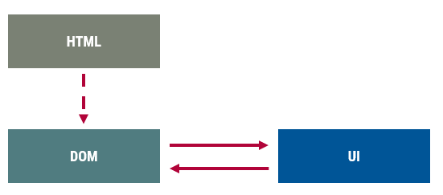
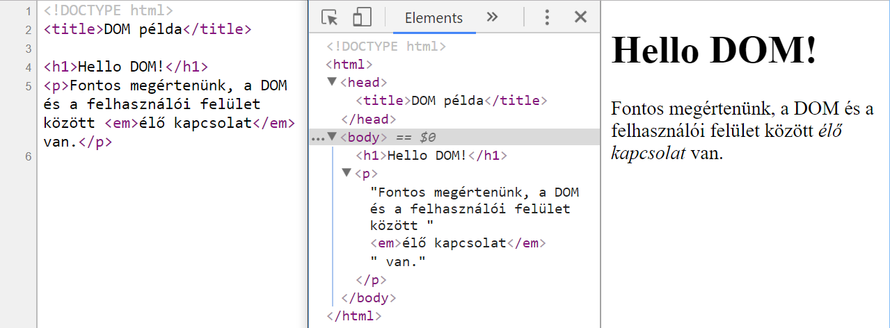
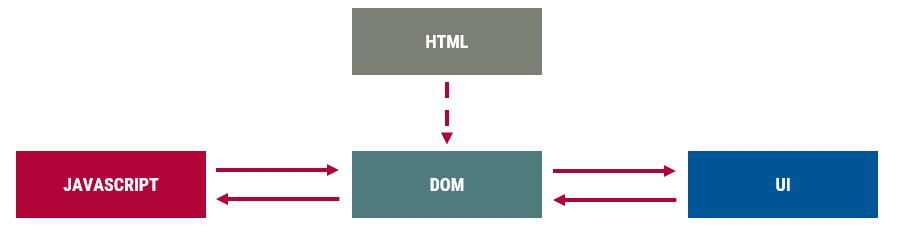
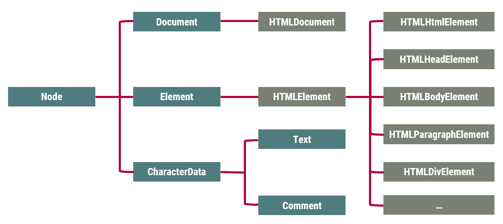
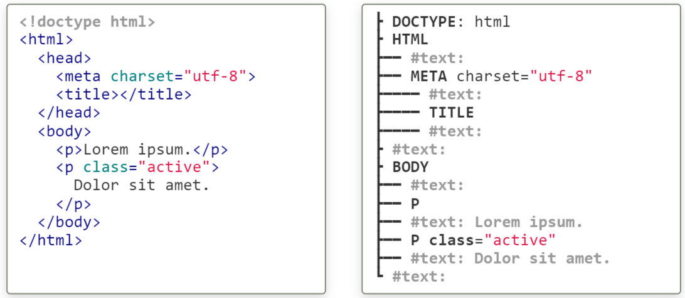

# Felületi elemek programozása

## Példa
- Feladat
  - Bekérni a nevet, pl "Senki bácsi"
  - Kiírni: "Hello Senki bácsi"
- Űrlap
  - Gomb lenyomása
  - Érték kiolvasása
  - Eredmény megjelenítése

```html
<form>
  Name: <input type="text" id="name">
  <input type="button" value="Say hello!" id="hello">
  <span id="output"></span>
</form>
```

## Megoldás lépései
1. Reagálni a gomb lenyomására
2. Kiolvasni a szöveges beviteli mező értékét (beolvasás)
3. Előállítani a bemenet alapján a kimenetet, azaz az üdvözlő szöveget (feldolgozás)
4. Megjeleníteni az üdvözlő szöveget (kiírás)

### Megoldás lépései (3)
Előállítani a bemenet alapján a kimenetet, azaz az üdvözlő szöveget (feldolgozás)

```js
function greet(name){
    return `Hello ${name}!`
}
```

## Felhasználói felület
- Interaktivitás
  - adatok megadása (beolvasás)
  - információ megjelenítése (kiírás)
- Elemei
  - **HTML**: oldal szerkezeteének leírása
  - **CSS**: megjelenés, stílus
  - **JavaScript**: program a felület működtetésére
- -> PROGRAMOZÁSI INTERFÉSZ A HTML ELEMEKHEZ
- Platfom-specifikum

## Dokumentum Objektum Modell (DOM)
- HTML elemek belső ábrázolása
- HTML elemeknek megfelelő JS objektumok hierarchiája



A forrás és a DOM eltérhet egymástól
<br></br>


- Programozási interfész (a felület felé)
- Bemeneti-kimeneti interfész



- Dom Core
  - csomópontok fája
  - árbrázolás és műveletek
- HTML DOM
  - HTML elemek fája



- HTML és XML dokumentumok programozási felülete
- Szabványos interfész fa struktúra alapú hierarchiához
- DOM gyökere: `document`
- DOM csomópontok
  - dokumentum
  - elem
  - attribútum
  - szöveges csomópont

## Szöveges csomópontok


## Műveletcsoportok
- Elemek kiválasztása
- Szerkezet bejárása
- Szerkezet módosítása
  - attribútumok
  - új elem/attribútum létrehozása
  - módosítás
  - törlés

# Elemek kiválasztása
CSS szelektorral:
- Egy elem: `document.querySelector(sel)
- Több elem: `document.querySelectorAll(sel)

```html
<form>
  Név: 
  <input id="name" value="Luke">
  <button>Click me!</button>
</form>
<script>
  console.log( document.querySelector("#name") );
  console.log( document.querySelectorAll("form > *") );
</script>
```

## CSS szelektorok (példákkal)
- névvel `button`
- azonosítóval `#navbar`
- stílusosztállyal `.important`
- attribútummal `[name=password]`
- univerzális `*`
- kombinálva `input.error[type=text]`
- közvetlen gyerek `form > input`
- leszárazott `#wrapper_div`
- következő testvér `ul + p`
- utána jövő testvérek `ul ~ p`

### Több elem kiválasztása
```html
<ul>
    <li>First</li>
    <li>Second</li>
    <li>Third</li>
</ul>
```
```js
const listItems = document.querySelectorAll('ul > li')

// Array-like object (NodeList)
for (const li of listItems) { /*...*/ }     // OK
listItems.forEach(li => { /*...*/ })        // OK
listItems.map(li => { /*...*/ })            // Wrong: not an array

// Transforming to array
const listItemsArray = Array.from(listItems);
listItemsArray.map(li => { /*...*/ });      // OK
```

### Kiválasztás leszármazottak közül
- `elem.querySelector(sel)`
- `elem.querySelectorAll(sel)`

```html
<div class="first">
    <span>Apple</span>
</div>
<div class="second">
    <span>Pear</span>
</div>
```
```js
const firstDiv = document.querySelector('div.first')
const spanInFirstDiv = firstDiv.querySelector('span')
```

### Példafeladatok
```html
<form>
  Name: <input type="text" id="name">
  <input type="button" value="Say hello!" id="hello">
  <span id="output"></span>
</form>
```
```js
const nameInput = document.querySelector('#name')
const nameInput = document.querySelector('form input[type=text]')
```

# DOM elem tulajdonságai és metódusai
- Szabvány
- Dokumentáció
- Analóg módszer (HTML)
- Felfedező módszer (fejlesztői eszköztár)

## Analóg módszer
- camelCase átírási mód
- Tulajdonságok
- HTML attribútum -> DOM tulajdonság
  - type -> type
  - value -> value
  - readonly -> readOnly
  - maxlength -> maxLength

## További fontosab tulajdonságok
- `innerHTML`, `innerText`: az elem nyitó- és záróelem közötti HTML vagy szöveg
```html
<p>This is a <span>text</span></p>
```
```js
const p = document.querySelector('p');
// reading
p.innerHTML; // 'This is a <span>text</span>'
p.innerText; // 'This is a text'
// writing
p.innerHTML = 'This is a <strong>new</strong> text';
```

## Példafeladat
```html
<form>
  Name: <input type="text" id="name">
  <input type="button" value="Say hello!" id="hello">
  <span id="output"></span>
</form>
```
```js
const input = document.querySelector('#name');
const name = input.value;
// Writing
const output = document.querySelector('#output');
output.innerHTML = greet(name);
```

## Megoldás lépései (2)
- Kiolvasni a szöveges beviteli mező értékét (beolvasás)
- Előállítania a bemenet alapján a kimenetet, azaz az üdvözlő szöveget (feldolgozás)
- Megjeleníteni az üdvözlő szöveget

```js
const input = document.querySelector('#name');
const name = input.value;
// Writing
const output = document.querySelector('#output');
output.innerHTML = greet(name);
```

# Eseménykezelés
1. Az esetményt kiváltó elem (pl. egy gomb)
2. Az esemény típusa (pl. kattintás)
3. Az eseményt kezelő függvény

`elem.addEventListener('eventType', eventHandler)`
```js
const button = document.querySelector('button');

button.addEventListener('click', handleButtonClick);

function handleButtonClick() {
  console.log('clicked');
}
```

## Megoldás lépései(3)
- Reagálni a gomb lenyomására
- Kiolvasni a szöveges beviteli mező értékét (beolvasás)
- Előállítania a bemenet alapján a kimenetet, azaz az üdvözlő szöveget (feldolgozás)
- Megjeleníteni az üdvözlő szöveget
```html
<form>
  Name: <input type="text" id="name"> <br>
  <input type="button" value="Say hello!" id="hello">
  <br>
  <span id="output"></span>
</form>
```
```js
function greet(name) {
  return `Hello ${name}!`;
}
function handleHelloClick() {
  const name = input.value;
  const greeting = greet(name);
  output.innerHTML = greeting;
}

const input = document.querySelector('#name');
const output = document.querySelector('#output');
const hello = document.querySelector('#hello');

hello.addEventListener('click', handleHelloClick);
```

## A DOM mint I/O
- A felhasználó a felhasználói felületen lép kapcsolatba a programmal
- A programbeli elérés a DOM-on keresztül lehetséges
- A program számára a DOM az I/O
- Beolvasás: DOM objektum tulajdonságának lekérése
- Kiírás: DOM objektum tulajdonságának módosítása
```html
<!-- Reading -->
<input type="checkbox" id="accept" checked>
<script>
  const elfogad = document.querySelector("#accept").checked;
</script>

<!-- Writing -->

<script>
  const url = "http://images.io/example.png";
  const image = document.querySelector("#image");
  image.src = url;
</script>
```

## Példa DOM I/O
```html
<input type="radio" name="gender" value="male" checked> Male
<input type="radio" name="gender" value="female"> Female
Maiden name: <input id="maidenName">
<script>
  // Reading
  const femaleRadio = 
    document.querySelector("[name=gender][value=female]");
  const isFemale = femaleRadio.checked;
  // Writing
  document.querySelector("#maidenName").hidden = !isFemale;
</script>
```

## Új elemek létrehozása
- A kiírás egy speciális formája
- A HTML kód szövegesen
- `innerHTML` tulajdonság írása
- Akár egyszerre több elemet is

```js
<div id="output"></div>
<script>
  const greeting = "<h1>Hello <em>World</em></h1>";
  const output = document.querySelector("#output");
  output.innerHTML = greeting;
</script>
```

## HTML generálás
```js
// Rövid statikus szöveg megadása
const html1 = `<h1>Hello there!</h1>`;

// Többsoros statikus szöveg megadása
const html2 = `
  <div>
    <p>No, <strong>I</strong> am your father!</p>
  </div>
`;

// Változók behelyettesítése
const callsign = 'Red 5';
const html3 = `${callsign}, standing by.`;

// Tömbök kiírása leképezéssel
const callsigns = ["Red 10", "Red 7", "Red 3", "Red 6", "Red 9"];
const html4 = `
  <p>All wings, report in.</p>
  <ul>
    ${callsigns.map(callsign => `
      <li>${callsign}, standing by.</li>
    `).join("")}
  </ul>
`;

// Feltételes kiírás (elágazás)
const chanceOfSuccess = 0.4;
const html5 = `
  <span>
    I have a 
    ${chanceOfSuccess < 0.5 ? "bad" : "good"}
    feeling about this.
  </span>
`;

// Függvényekkel
function hanDescription(properties) {
  return `
    You
    <ul>
      ${properties.map(hanProperty).join("")}
    </ul>
    Nerf Herder!
  `;
}

function hanProperty(property) {
  return `<li>${property}</li>`;
}

const hanProperties = [
  "stuck up",
  "half witted",
  "scruffy looking"
];
const html6 = hanDescription(hanProperties);
```

### Programozottan
- Létrehozás
  - `document.createElement(elem)`
- Beszúrás
  - `parent.appendChild(child)`: szülő gyerekeihez utolsóként hozzáadja az új elemet
  - `parent.insertBefore(newChild, refChild)`: referncia elé beszúrja az új elemet

```html
<body>
  <ul>
    <li>First</li>
    <li>Second</li>
         
    <li>Third</li>
  </ul>

</body>
```
```js
const p = document.createElement('p');
document.body.appendChild(p);

const newLi = document.createElement('li');
const ul = document.querySelector('ul');
const refLi = 
  ul.querySelector('li:nth-of-type(3)');
ul.insertBefore(newLi, refLi);
```

# Stílusattribútumok programozása
CSS tulajdonság -> `style` objektum tulajdonsága
- left - left
- background-color - backgroundColor
- border-bottom-width - borderBottomWidth
- border-top-left-radius - borderTopLeftRadius

```html
<div style="position: absolute" id="movingElement"></div>
<script>
  document.querySelector("#movingElement").style.top  = "25px";
  document.querySelector("#movingElement").style.left = "42px";
</script>
```

## Stílusobjektum
- `elem.style`: `CSSSyleDeclaration` objektum
- Az összes stílustulajdonságot tartalmazza
- Tetszőleges tulajdonság beállítható (írás)
- Lekérdezhető stílustulajdonságok (olvasás)
  - a `style` attribútumon keresztül voltak megadva
  - JavaScriptből határoztuk meg az értéküket

### Példa
```html
<style>
.box {
  position: absolute;
  width: 100px; height: 100px;
}
</style>
<div class="box" style="left: 20px"></div>
```
```js
const box = document.querySelector("div");
box.style.top = "30px";

box.style.top;       // "30px"  <-- JS
box.style.left;      // "20px"  <-- style attribute
box.style.width;     // ""
box.style.position;  // ""
```

## Számított stílus
- `window.getComputedStyle(elem)`
- A böngésző által nyilvántartott stílustulajdonságok
- A rövidítések (pl. `border`, `background`, stb) nem érhető el, csak az elemi tulajdonságokű

### Példa
```html
<style>
.box {
  position: absolute;
  width: 100px; height: 100px;
}
</style>
<div class="box" style="left: 20px"></div>
```
```js
const box = document.querySelector("div");
box.top = "30px";

const computedStyle = window.getComputedStyle(box);
computedStyle.top       // "30px"
computedStyle.left      // "20px"
computedStyle.width     // "100px"
computedStyle.position  // "absolute"
```

## Stílusosztály programozása
`classList` tulajdonság
- `add(osztály)`
- `remove(osztály)`
- `toggle(osztály)`
- `contains(osztály)`
  
### Példa
```js
const div = document.querySelector('div');
div.classList.remove("green");
div.classList.add("pink");

// váltogatás
div.classList.toggle("pink");

// feltételes megjelenítés
div.classList.toggle("pink", i < 10);

// van-e adott stílusosztály
div.classList.contains("red");  // true

// több hozzáadása egyszerre
div.classList.add("orange", "yellow");
```

## Stíluslapok
- `document.styleSheets` -> tömb(StyleSheet)
- Fontosabb tulajdonságok
  - `type`
  - `disabled` (stíluslap dinamikus ki-bekapcsolása)
  - `href`
  - `title`
  - `cssRules`: szabályok módosítása
    - `cssText`: a szabály szöveges formája
    - `selectorText` (nem szabványos)
    - `style`: az adott szabály stílusmintája (mint az inner style)
  
# DOM tulajdonságok és metódusok

## Attribútumprogramozás
- `getAttribute(name)`
- `setAttribute(name, value)`
- `hasAttribute(value)`
- `removeAttribute(name)`
- `toggleAttribute(name[, predicate])`
```html
<button type="submit" data-id="10" disabled>A button</button>
```
```js
const b = document.querySelector('button')
// reading
b.getAttribute('type')      // 'submit'
b.getAttribute('data-id')   // '10'
b.getAttribute('disabled')  // ''
b.getAttribute('foo')       // null or ''
b.hasAttribute('disabled')  // true
// writing
b.setAttribute('name', 'send')
b.setAttribute('hidden', '')  // boolean attribute
b.toggleAttribute('disabled') // toggle boolean attribute
```

`data-*` attribútum -> `dataset` tulajdonság
```html
<div 
  data-id="10"
  data-some-text="foo"
></div>
```
```js
const div = document.querySelector('div')
// reading
div.dataset.id        // "10"
div.dataset.someText  // "foo"
// writing
div.dataset.someText = "bar"
div.dataset.user = "John"               // --> data-user="John"
div.dataset.dateOfBirth = "2000-12-12"  // --> data-date-of-birth="2000-12-12"
// removing
delete div.dataset.id
// checking
'someText' in el.dataset  // true
'id' in el.dataset        // false
```

## Szerkezet módosítása
- `parent.appendChild(item)`: beszúrás
- `parent.insertBefore(elem, reg)`: beszúrás
- `parent.removeChild(item)`: törlés
- `parent.replaceChild(elem, oldElem)`: csere
- Ha `elem` létezik, akkor mozgatás

## Példa: hányadik elem
```html
<ul>
  <li>első</li>
  <li>második</li>
  <li>harmadik</li>
  <li>negyedik</li>
  <li>ötödik</li>
</ul>
```
```js
function getPosition(element) {
  let count = 0;
  while ( null != el ) {
    el = el.previousElementSibling;
    count++;
  }
  return count;
}

const secondChild = document.querySelector('ul > li:nth-child(2)');
const position = getPosition(secondChild); // 2
```