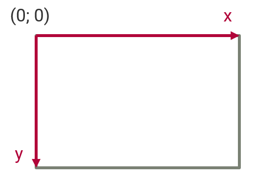
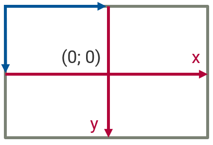
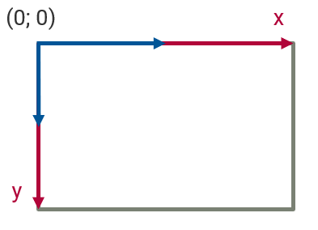
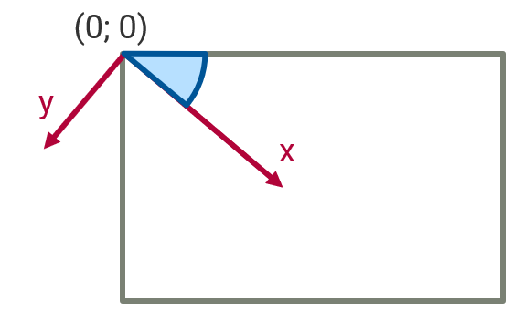
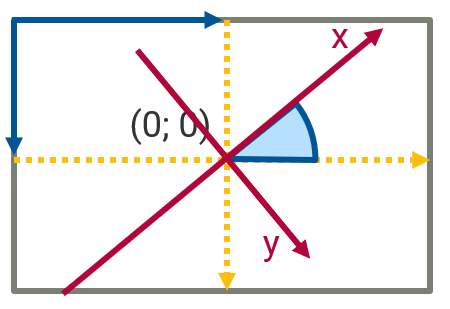
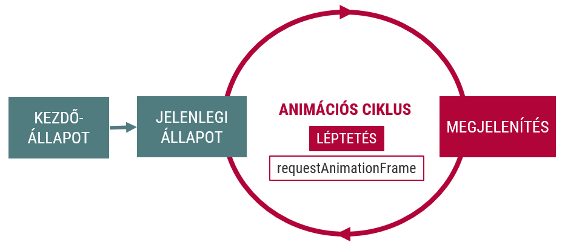
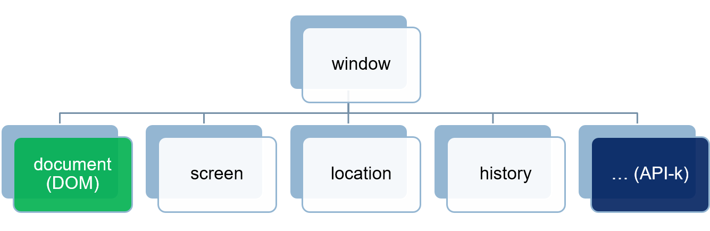

# Canvas API

## Grafikus lehetőségek a böngészőben
- Képfájlok
- CSS formázás
- (Inline) SVG (vektorgrafika)
- Canvas (raszteres grafika)

## Canvas

```html
<canvas width="200", height="200"></canvas>
```
```js
// Canvas elem elérése
const canvas = document.querySelector('canvas')
// 2D rajzolási "kontextus" elérése
const context = canvas.getContext('2d')
```

### A Canvas koordinátarendszere


## Rajzolás alakzatokkal, képekkel
A `CanvasRenderingContext2D` műveletei
- Szöveg (`fillText`, `strokeText`)
- Téglalap (`fillRect`, `strokeRect`)
- Kép (`drawImage`)
  - Forrás: kép, canvas, videó
  - `drawImage(image, x, y)`
  - `drawImage(image, x, y, width, height)`
  - `drawImage(image, sx, sy, sWidth, sHeight, dx, dy, dWidth, dHeight)`
- Törlés (`clearRect`)

## Rajzolás útvonalakkal
- Útvonal kezdete (`beginPath`)
- Útvonal lezárása (`closePath`)
- Útvonal kitöltése (`fill`)
- Útvonal megrajzolása (`stroke`)
- Téglalap (`rect`)
- Ellipszis (`ellipse`)
- Körív (`arc`)
- "Toll" mozgatása (`moveTo`)
- Vonal (`lineTo`)
- Bezier-görbe (`bezierCurceTo`)
- Kvadratikus görbe (`quadraticCurveTo`)

## Beállítások
- Kitöltés színe/mintázata (`fillStyle`)
- Vonal színe (`strokeStyle`)
- Vonal vastagsága (`lineWidth`)
- Vonalak vége (`lineCap`)
- Vonalak illeszkedése (`lineJoin`)
- Áttetszőség (`globalAlpha`)

## Transzformációk
- Műveletek
  - Forgatás (`rotate`)
  - Mérezetés (`scale`)
  - Eltolás (`translate`)
  - Összetett (`transform`)
- Állapotkezelés
  - `save`
  - `restore`

### Eltolás
```js
context.translate(100, 100)
```


### Méretezés
```js
context.scale(2,2)
```


### Forgatás
```js
context.rotate(Math.PI /4)
```


### Komplex transzformáció
```js
context.translate(100, 100)
context.rotate(-Math.PI / 4)
context.rotate(Math.PI / 4)
context.translate(-100, -100)
```



# Animációk

- Alapelv: vásznon lévő kép **gyors** újrarajzolása
  - Változások rajzolása
  - Teljes rajzolás
    - canvas törlése
    - rajzolás
- Architektúra
  - Állapottér (adatok)
  - Nézet (rajzolás)

## Animációs ciklus

```js
const state = /*...*/;

function next() {
  update(); // Update current state
  render(); // Rerender the frame
  requestAnimationFrame(next);
}

next(); // Start the loop

function update() { /* Change app state */ }
function render() { /* Draw app state   */ }
```

# API-k a böngészőben
- Programozási interfészek erőforrások eléréséhez/kezeléséhez
  - BOM (Browser Object Model)
  - Location API
  - Geolocation API
  - MediaDevices API
  - File API

## BOM (window)
- DOM-ot tartalmazó ablak (fül), JS kontextusa
- Globális névtér
- Ablakhoz kapcsolódó funkciók
- Sok egyéb API-nak a tárolója
- Browser Object Model (BOM)



### Új ablak
- `window.open()`, `window.close()`
- `opener`
- Az új ablak referenciája egy `window` objektum

```js
const options = "resizable,width=800,height=600,scrollbars=yes";
const elte = window.open("http://www.elte.hu", "ELTE", options);
elte.resizeTo(400, 200);
elte.document.querySelector("p");
elte.opener; // window
elte.close();
```

## Location API
- A címsor tartalmának olvasása
- Az egyes részek külön kezelhetők
- `hash`, `host`, `hostname`, `href`, `origin`, `pathname`, `port`, `protocol`, `search`, `username`, `password`

```js
location.href       // Az egész URL
location.host       // "example.com:8080"
location.hostname   // "example.com"
location.origin     // "http://example.com:8080"
location.pathname   // "/page.html"
location.port       // 8080
location.protocol   // "http:"
location.search     // "?name=value"
location.hash       // "#anchor"
```

- URL módosítása
  - `assign(newUrl)`: új oldal betöltése
  - `replace(newUrl)`: jelenlegi felülírása
  - `reload()`: újratöltés
- Események
  - `hashchange`: az URL fragment megváltoztatása

```js
window.location = "http://www.elte.hu";
window.location.href = "http://www.elte.hu";
window.location.assign("http://www.elte.hu");
window.location.replace("http://www.elte.hu");
window.location.reload();
```

### URLSearchParams
A `location.search` paraméter feldolgozására
```js
searchParams.has("paramName");
searchParams.get("paramName");
searchParams.getAll("paramName");
searchParams.set("paramName");
searchParams.append("paramName", "paramValue");
searchParams.delete("paramName");
```

### History
Közlekedés az előzményekben
- `window.hisotry`
  - `back()`
  - `forward()`
  - `go(n)`

```js
window.history.back()
window.history.forward()
window.history.go(-3)
```

## Iframe programozás
- Támogatott
- Ablak az ablakon belül
- Szeparált környezet
  - sandboxing
  - aszinkron kommunikáció
- Elérés
  - `window.parent`
  - `iframe.contentWindow`
  - `iframe.contentWindow.document`
  - `iframe.contentDocument`
- Same Origin Policy

## PostMessage
- Felügyelt kommunikáció ablakok között
- `postMessage()`, `message` esemény

```html
<iframe src="http://localhost:8081/window.postmessage.iframe.html"></iframe>
```

```js
// parent window
window.addEventListener('load', function () {
    const iframe = document.querySelector('iframe')
    iframe.contentWindow.postMessage("message", "http://localhost:8081")
})
window.addEventListener('message', function (e) {
    console.log(e.origin, e.data)
})
```

```js
// iframe
window.addEventListener('message', function (e) {
    if (e.origin === "http://localhost:8080") {
        console.log(e.data)
        window.parent.postMessage('message back', 'http://localhost:8080')
    }
})
```

# Médiaelemek vezérlése
## Audio
- Hangállományok lejátszása
- `HTMLAudioElement`

```js
<audo src="horn.waw" id="audio1" controls></audio>
```

```js
// meglévő elem
document.querySelector('audio').play()

// in-memory elem
const audio = document.createElement('audio')
audio.src = 'horn.waw'
audio.play()
```

## Video
- HTML `<video>` tag
- `HTMLVideoElement`

```js
const canvas = document.querySelector('canvas')
const ctx = canvas.getContext('2d')
const video = document.querySelector('video')
const mainloop = function() {
    window.requestAnimationFrame(mainloop)
    ctx.drawImage(video, 0, 0, canvas.width, canvas.height)
}
mainloop()
```