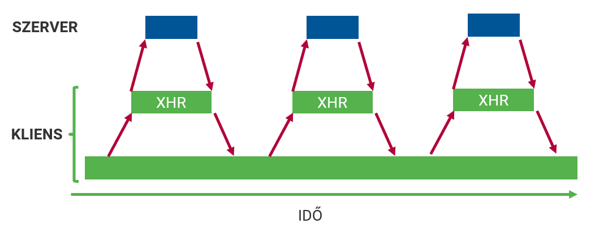

# JSON
- JavaScript Object Notation
- Adatleíró formátum
- A JavaScript literálformáira épül
- Központ eleme
  - objektum: `{}`
  - tömb: `[]`
- Elterjedt és népszerű
- `JSON.stringify()`
- `JSON.parse()`

## JSON - példa
```JSON
{
  "Title": "The Hobbit: An Unexpected Journey",
  "Year": "2012",
  "Rated": "PG-13",
  "Released": "14 Dec 2012",
  "Runtime": "169 min",
  "Genre": "Adventure, Fantasy",
  "Director": "Peter Jackson",
  "Language": "English",
  "Country": "USA, New Zealand",
  "Poster": "https://m.media-amazon.com/images/<...>",
  "Ratings": [
    {
      "Source": "Internet Movie Database",
      "Value": "7.8/10"
    },
    {
      "Source": "Rotten Tomatoes",
      "Value": "64%"
    },
    {
      "Source": "Metacritic",
      "Value": "58/100"
    }
  ],
  "Metascore": "58",
  "imdbRating": "7.8",
  "imdbVotes": "725,598",
  "imdbID": "tt0903624",
  "Type": "movie",
  "DVD": "19 Mar 2013",
  "BoxOffice": "$303,001,229",
  "Production": "Warner Bros.",
  "Website": "N/A",
  "Response": "True"
}
```

## JSON soroítás oda-vissza
```js
const data = {
  foo: "string",
  bar: [1, 2, 3]
}

// Serialization
const serializedData = JSON.stringify(data);
console.log(serializedData);
// '{"foo":"string","bar":[1,2,3]}'

// Deserialization
const deserializedData = JSON.parse(serializedData);
console.log(deserializedData);
// Object { foo: "string", bar: Array[3] }
```

# Szinkron vs Aszinkron programozás

## Szinkron műveletek
- Szinkron ~ szinkronizált ~ összekapcsolt ~ függő
- Szinkron művelet: meg kell várni, a végét, mielőtt a következőre ugranánk
- Az egyik művelet eleje függ a másik végétől
- Szekvencia


### Szinkron példa
```js
console.log("first")
alert("second")
console.log("third")
```

### Szinkron végrehajtás


### Szinkron hátránya
- Hoszzú műveletek megvárása
  - időztítők
  - hálózati műveletek
  - lemezkezelés

## Aszinkron műveletek
- Másik feladat elindítható az egyik vége előtt
- Nem függnek egymástól


### Szinkron vs Aszinkron


### Példa: szinkron vs aszinkron
**Szinkron:** Mozijegyért állsz sorba. Addig nem tudod megvenni, amíg az előtted lévők nem vették meg, és ugyanez igaz a mögötted állókra is

**Aszinkron:** Étteremben vagy sok más emberrel együtt. Megrendeled az ételed. Mások is rendelhetnek ételt, nem kell megvárniuk, amíg a tiedet elkészítik és felszolgálják. A konyhában a dolgozók folyamatosan főznek, szolgálnak fel és rendeléseket fogadnak. Az emberek akkor fogják az ételüket megkapni, amikor az elkészült.

## Callback függvény
- Paraméterként átadott függvény meghívása
- Ő maga nem szinkron/aszinkron
- Az API szinkron/aszinkron

```js
// Syncronous
function a(b) {
    b();  // callback
}

console.log("first");
a(function () {
  console.log("second");
});
console.log("third");

// OR

[1, 3, 5].map(e => e * 2);


// Asyncronous
console.log("first");

setTimeout(function () {
  console.log("second");
}, 1000);

console.log("third");
```

### Probléma: Callback hell
```js
setTimeout(() => {
  console.log("first");
  setTimeout(() => {
    console.log("second");
    setTimeout(() => {
      console.log("third");
      setTimeout(() => {
        console.log("fourth");
      },1000);
    }, 1000);
  }, 1000);
}, 1000);
```

### Megoldás: promise
- Aszinkron művelet jövőbeli értékét reprezentáló objektum
- Állapota: `pending`, `fulfilled`, `rejected`
- Metódusok: `.then()`, `.catch()`
  
```js
function delay(ms) {
  return new Promise(function (resolve, reject) {
    setTimeout(() => {
      console.log(`${ms} timeout`);
      resolve(ms);
    }, ms);
  });
}

// USAGE

delay(1000).then(ms => console.log("Result", ms));
```

### Promise lánc
```js
delay(1000)
  .then((ms) => { return delay(500);          })
  .then((ms) => { return delay(2000);         })
  .then((ms) => { return 800;                 })
  .then((ms) => { console.log("Finally", ms); })
  .catch(() => {
    console.log("There are some errors");
  });
```

### Async - Await
- ES8 (2017) óta része a szabványnak
- Promise-okkal dolgozik

```js
async function lotOfDelays() {
  try {
    await delay(500);
    await delay(2000);
    const ms = await delay(800);
    console.log("Finally", ms);
  } catch {
    console.log("There are some errors")
  }
}

lotOfDelays();
```

# AJAX és fetch

## Hagyományos oldalak


## AJAX-os oldalak


## AJAX
- Asynchronous JavaScript and XML
- A kapcsolatfelvétel a szerverrel szükséges
- Csak a szükséges adatok továbbítása a hattérben
- A teljes odal újratöltése nélkül

### AJAX-os oldal tulajdonságai
- A felhasználói felület folyamatosan használható
- Nincs szaggatottság, villogás, ugrálás
- A szerverrel való kommunikáció a háttérben történik
- Aszinkron módon, azaz párhuzamosan a többi eseménnyel
- Csak a szükséges adatok közlekednek a szerver és a kliens között.

### AJAX hívás eszközei
- API
  - `XMLHttpRequest` objektum és használata
  - `fetch` és használata
- Fejlesztői eszköztár
  - Hálózat fül

