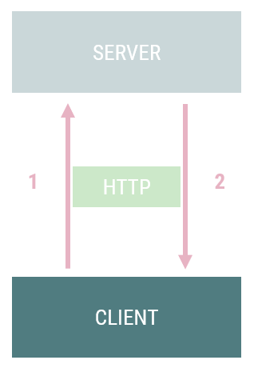
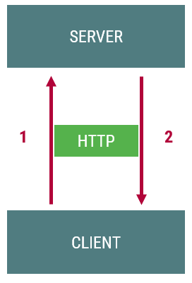
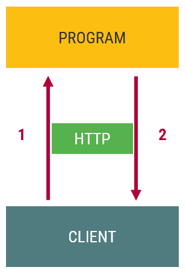
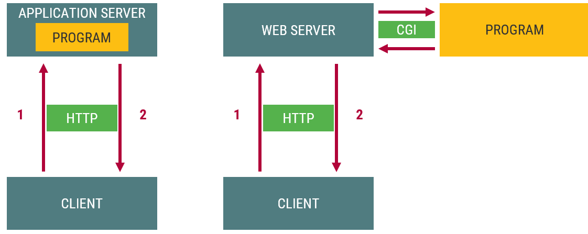
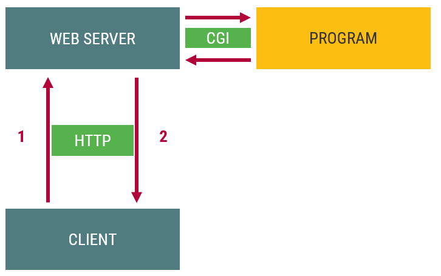
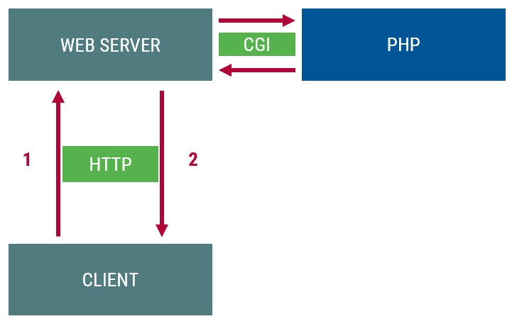

# Szerveroldali webprogramozás

## Világháló

A világháló egy olyan információs rendszer, amelyben
- **dokumentumokat** és más erőforrásaokat
- **egységes címmel** azonosítunk
- ezeket **hiperhivatkozásokkal** kötjük össze
- elérhetőségüket **internetre kötött szerverek** segítségével biztosítjuk
- megtekintésük pedig speciális kliensprogramokban, **böngészőkben** történik

## WEB komponensei, szabványai
- HTML (dokumentumok, hiperhivatkozások)
- URL (erőforrások egységes címe)
- webszerver (erőforrások elérhetővé tétele)
- webkliens, webböngésző (erőforrások megjelenítése)
- HTTP (kliens-szerver kommunikáció)

## Kliensoldali webprogramozás
Egy komponens
- Kliens-szerver architektúra
- Statikus/dinamikus kliens
- Nem érdekes a szerver, csak az onnan érkező tartalom
- Nem is kell szerver, dolgozhatunk lokálisan
- Programozás a böngészőben
- JavaScript, DOM, stb...


## Kliens-Szerver architektúra
Több komponens
- Kliens
- Szerver
- HTTP (kommunikáció)
  - Kérés (request)
  - Válasz (response)


Térben és időben elválhatnak


## Statikus szerveroldali tartalom
Kérés pillanatában a szerveren megtalálható az a tartalom, amely leküldésre kerül a válaszban
- Fájlkiszolgálás
- Kiterjesztés alapján
  - `.html`
  - `.jpg`, `.png`, `.gif`
  - `.css`
  - `.js`

## Dinamikus szerveroldai tartalom
A leküldendő tartalmat egy program állítja elő


## Architektúrák


## Szerveroldali webprogramozás
- Nem egyszerű fájlkiszolgálás
- Indítás
  - `cgi-bin` könyvtár
  - kiterjesztés (pl. `.cgi`, `.php`)
- Program
  - **bármilyen**
  - bináris (C++, Pascal)
  - szkript (PHP, Python, Ruby)


- Program célja, kimenete
  - HTML generálás (általában)
  - Tartalom generálás (általánosan)
  - HTTP protokoll betartásával
- Program helyességét a generált tartalom, a megkapott oldal forrása alapján ellenőrizhetjük

# URL, HTTP, CGI

## URL


## HTTP protokoll
- Kérés-válasz alapú protokoll a kliens és szerver között
- Mindig a kliens kezdeményes
- Kliens: kérés
  - kérést küld a 80-as/443-as TCP portra
  - jellemzően böngésző (hivatkozások, formok)
- Szerver: válasz
- TCP/IP réteg feletti protokoll

### HTTP üzenetstruktúra
#### Kérés
```
POST / HTTP/1.1
Host: localhost:8000
User-Agent: Mozilla/5.0 (...)
Accept: text/html
Accept-Language: en-Us
Accept-Encoding: gzip, deflate
Connection: keep-alive
Content-Type: multipart/form-data
Content-Length: 345
                
-12656974
(more data... )
```
#### Felépítés
```
start-line


headers


blank
body
```
#### Válasz
```
HTTP/1.1 403 Forbidden
Server: Apache
Content-Type: text/html;charset=utf-8
Date: Wed, 10 Aug 2016 09:23:25 GMT
Keep-Alive: timeout=5, max=1000
Connection: Keep-Alive
Age: 3465
X-Cache-Info: caching
Content-Length: 220
                
<!DOCTYPE html>
(more data...)
```

## HTTP metódusok
- `GET`: Megadott erőforrás letöltése
- `POST`: Feldolgozandó adat felküldése
- `DELETE`: Törli a megadott erőforrást
- `PATCH`: Adott erőforrás javítása, frissítése
- `HEAD`: Ld. `GET`, de csak a válasz fejléceket kéri le
- `PUT`: Feltölti a megadott erőforrást
- `TRACE`: Visszaküldi a kapott kérést
- `OPTIONS`: A szerver által támogatott HTTP metódusok listája
- `CONNECT`: Kérést transzparens tunnellé alakítja (SSL)

### HTTP kérés példa
```
GET /index.html HTTP/1.1
Host: webprogramozas.inf.elte.hu
```
```
GET / HTTP/1.1
Host: webprogramozas.inf.elte.hu
User-Agent: Mozilla/5.0 (Windows NT 6.1; rv:19.0) Gecko/20100101 Firefox/19.0
Accept: text/html,application/xhtml+xml,application/xml;q=0.9,*/*;q=0.8
Accept-Language: hu-hu,hu;q=0.8,en-US;q=0.5,en;q=0.3
Accept-Encoding: gzip, deflate
Connection: keep-alive
```

## HTTP státuszkódok
- `1xx`: Informatív (kérés megkapva)
- `2xx`: Siker (kérés megérkezett, elfogadva)
  - 200 OK
- `3xx`: Átirányítás (további műveletre van szükség)
- `4xx`: Kliens hiba (kérés hibás, nem teljesíthető)
  - 403 Forbidden
  - 404 Not found
- `5xx`: Szerver hiba (nem tudja teljesíteni a kérést)
  - 500 Internal Server Error

### HTTP válasz példa
```
HTTP/1.1 200 OK
Date: Wed, 03 Apr 2013 07:11:56 GMT
Server: Apache/2.2.10 (Linux/SUSE)
Last-Modified: Wed, 20 Feb 2013 08:39:44 GMT
ETag: "fe8438-6d6-4d623e65e9400"
Accept-Ranges: bytes
Content-Length: 1750
Content-Type: text/html

<!DOCTYPE html>
<html>
    ...
</html>
```

## HTTP eszközök
Webfejlesztési eszköztár -> Hálózat (Network) fül

## Common Gateway Interface (CGI)
Azt határozza meg, hogy egy webszerver hogyan indíthat el egy programot és milyen módon cserél adatot vele
- Indítás: program futtatása
- Adatok
  - Környezeti változók
  - standard I/O
- Program eredménye
  - standard kimenten

### Példa C++
```cpp
#include <iostream>
using namespace std;
int main()
{
    cout << "Content-Type: text/html" << endl;
    cout << endl;

    cout << "<!doctype html>" << endl;
    cout << "<html>" << endl;
    cout << "    <head>" << endl;
    cout << "        <meta charset=\"utf-8\">" << endl;
    cout << "        <title></title>" << endl;
    cout << "    </head>" << endl;
    cout << "    <body>" << endl;
    cout << "        <p>Hello vilag!</p>" << endl;
    cout << "    </body>" << endl;
    cout << "</html>" << endl;

    return 0;
}
```
A fenti kód parancssorból lefuttatva
```
Content-Type: text/html

<!doctype html>
<html>
    <head>
        <meta charset="utf-8">
        <title></title>
    </head>
    <body>
        <p>Hello vilag!</p>
    </body>
</html>
```

A fenti kód böngészőből futtatva
```
Hello vilag!
```

# PHP
## PHP a webprogramozásban
`http://szerver/peldak/pelda.php`


## PHP használata
- Szerveroldai dinamikus webprogramozás
  - weboldalak generálása
- CLI - Command Line Interface
  - PHP scriptek parancssori futtatása

## JavaScript vs PHP
Változók neve `$` jellel kezdődik
```js
// declaration 
const x = [1, 3, 5, 7, 9];
let s;
// process 
s = 0;
for(let i=0; i<x.length; i++) {
  s = s + x[i];
}
// output 
console.log('Sum: ',  s)
```

```php
// declaration 
$x = [1, 3, 5, 7, 9];

// process 
$s = 0;
for($i=0; $i<count($x); $i++) {
    $s = $s + $x[$i];
}
// output 
echo 'Sum: ', $s;
```

## PHP mint programozási nyelv
- Dinamikusan típusos
  - változók típusa a benne tárolt értéktől függ
  - automaikus típuskonverziók
- Értelmezett
- Szkriptnyelv
- Részben case sensitive
- Utasítások végén `;`
- Többparadigmás nyelv
  - procedurális
  - OOP
  - funkcionális
- C alapú szintaxis
- Nincs főprogram
- Hasonló a JavaScripthez
  - szintaxis
  - vezérlési szerkezetek, operátorok
  - viselkedés

## Megjegyzések
```php
// egysoros megjegyzés

#  Perl szintaktikájú egysoros megjegyzés

/*
többsoros
megjegyzés
*/
```

## Típusok
- Egyszerű típusok
  - logikai (`bool`)
  - egész (`int`)
  - lebegőpontos (`float`)
  - szöveg (`string`)
- Összetett típusok
  - tömb (`array`)
  - objektum (`object`)
  - függvény (`callable`)
- Speciális típusok
  - erőforrás
  - `NULL`

## Literálok
```php
//Logikai
true
false

//Egész
12     //decimális
-34
0123   //oktális
0x0F   //hexadecimális
0b0101 //bináris

//Lebegőpontos
3.1415
5.6e12
-7E-2
```

```php
$a = 12;
// Aposztróf: nem helyettesít be
'alma\t${a} alma' // alma\t{$a} alma
'Több
sor is lehet benne'

// Macskaköröm: behelyettesít
"alma\t${a} alma" // alma   12 alma
"Ez egy
több soros szöveg"

// Heredoc: behelyettesít
<<<EOT
Több soros {$a}
szöveg
EOT

// Nowdoc: nem helyettesít be
<<<'EOT'
Ez is lehet {$a}
több soros.
EOT
```

## Típusokkal kapcsolatos fontos függvények
- Típusbeállítás
  - típuskényszerítés `(int)$a`
  - `settpype()`
- Speciális függvények
  - `isset()`
  - `is_null()`
  - `empty()`
- Típuslekérdezés
  - `gettype()`
  - `is_integer()`
  - `is_float()`
  - `is_numberic()`
  - `is_string()`
  - `is_bool()`
  - ...

## Operátorok
- Kb. ugyanaz, mint JavaScriptben
- Különbség
  - `+` kizárólag összeadás
  - `.` szövegösszefűzés
- Újdonság
  - `$a <=> $b`: összehasonlítás (-1, 0, 0)
  - `$a ?? $b ?? $c` az első elem nem `NULL`
  -  `$a ?: $b`: megegyezik `$a ? $a : $b`

## Vezérlési szerkezetek
Lásd C++ vagy JavaScript továbbá
```
foreach ($tomb as $ertek) {
  utasítások;
}

foreach ($tomb as $kulcs => $ertek) {
  utasítások;
}
```

# Függvények
```cpp
// C++
int add(int a, int b) {
  return a + b;
}
```
```js
// JavaScript
function add(a, b) {
  return a + b;
}
```
```php
// PHP
function add($a, $b) {
  return $a + $b;
}
// or
function add(int $a, int $b): int {
  return $a + $b;
}
```

```php
// Default value
function greet($name = 'somebody') {
  return "Hello ${name}!";
}
greet();    // "Hello somebody!"

// Pass by reference
$szam = 41;
function novel(&$szam) {
  $szam += 1;
}
novel($szam);
print($szam);    // 42

// Anonymous function literal
$add = function ($a, $b) {
  return $a + $b;
}
print($add(10, 32)); // 42

// Accessing global scope
$globus = 'Föld';
function zartFuggveny() {
  global $globus;
  print("Gyönyörű a ${globus}!");
}
// or
function zartFuggveny() {
  print("Gyönyörű a ${GLOBALS['globus']}!");
}
// or, accessing just the parent scope
$zartFuggveny = function () use ($globus) {
  print("Gyönyörű a ${globus}!");
}
```

## Típusannotációk
```php
// Szigorú típusosság
declare(strict_types=1);

function add(int $a, int $b): int {
    return $a + $b;
}

var_dump(add(1, 2));
var_dump(add(1.5, 2.5)); // Hibát dob

// Gyenge típusosságnál automatikus konverziók történnek
function sum(int $a, int $b) {
    return $a + $b;
}

var_dump(sum(1.5, 2.5)); // 3
```

# Tömb
- Gyűjtemények általános objektuma
- Asszociatív tömb: kulcs-érték párokból áll
  - kulcs: `integer` vagy `string`
  - érték: `bármilyen típusú lehet`
- Összetett adatszerkezet megvalósítása
  - rekord
  - indexelt tömb
  - asszociatív tömb
  - többdimenziós tömb
  - fa, sor, verem, stb.

```php
// Üres tömb
$arr = array();
// vagy
$arr = [];

// Indexelt tömb létrehozása
$arr = array('alma', 'korte', 'szilva');
// vagy
$arr = ['alma', 'korte', 'szilva'];

// A tömb hosszának lekérdezése
count($arr);    // => 3

// Hivatkozás
$arr[0]; //'alma'

// Elemek módosítása
$arr[1] = 13;
$arr[1];        //13

// Új elem beszúrása a tömb végére
$arr[] = 'új';

// Elem törlése
unset($arr[1]);

// Mátrix: tömbök tömbje
$matrix = [
  [1, 2, 3],
  [4, 5, 6],
  [7, 8, 9],
];

// Index beállítása
$other = [ 1 => 'alma', 'korte', 'szilva'];
```

## Asszociatív tömb
```php
// Asszociatív tömb
$asszTomb = array(
  'alma'    => 'piros',
  'korte'   => 'sarga',
  'szilva'  => 'kek',
);
// vagy
$asszTomb = [
  'alma'    => 'piros',
  'korte'   => 'sarga',
  'szilva'  => 'kek',
];

// Hivatkozás
$asszTomb['alma']; //piros
```

## Tömbök bejárása
- `froeach`
- `reset()`, `next()`, `prev()`, `current()`, `key()`, `each()`

```php
$gyumolcsok = [
  'alma'    => 'piros',
  'korte'   => 'sárga',
  'szilva'  => 'kék',
];

// foreach
foreach ($gyumolcsok as $gyumolcs => $szin) {
    print("${szin} ${gyumolcs}\n");
}
/*
piros alma
sárga korte
kék szilva
*/

//tömbműveletekkel
reset($gyumolcsok);
while (list($kulcs, $ertek) = each($gyumolcsok)) {
  print("${ertek} ${kulcs}\n");
}
```

## Összegzés tétel
```php
function osszegzes($tomb) {
  $s = 0;
  foreach ($tomb as $szam) {
    $s = $s + $szam;
  }
  return $s;
}

$x = [1, 3, -2, 8];
$result = osszegzes($x);
```

## Eldöntés tétel
```php
function eldontes(array $tomb, callable $fn): bool {
  $i = 0;
  while ($i < count($tomb) && !$fn($tomb[$i])) {
    $i += 1;
  }
  return $i < count($tomb);
}
// or
function eldontes(array $tomb, callable $fn): bool {
  reset($tomb);
  while ((list(, $e) = each($tomb)) && !$fn($e)) { }
  return $e !== NULL;
}

$x = [1, 3, -2, 8];
$result = eldontes($x, function($e) { return $e < 0; });
```

## Tömbműveletek
- `array_map(callable $fn, array $x)`: másolás
- `array_filter(array $x, callable $fn)`: kiválogatás
- `array_reduce(array $x, callable $fn, $initial)`: általános összegzés
- `array_sum(array $x)`: összegzés
- `array_walk(array $x, callable $fn)`: iteráció

```php
$numbers = [1, 2, 3, 4, 5];
$evens = array_filter($numbers, function ($e) {
  return $e % 2 === 0;
});
```

- `in_array($mit, $tömb)`: eldöntés (logikai)
- `array_search($mit, $tömb)`: lineáris keresés (kulcs)
- `sort($tömb)`: renezés (többféle van)
- `shuffle($tömb)`: keverés
- `array_keys($tömb)`: `$tömb` kulcsai tömbként
- `array_values($tömb)`: `$tömb` értékei tömbként
- `array_key_exists($kulcs, $tömb)`: `$kulcs` szerepel-e a `$tömb` kulcsai között

## Adatszerkezetek
### Tömb
```php
$kutyuk = [
  'telefon',
  'fülhallgató',
  'pendrive',
  'e-könyv olvasó',
];
```

### Rekord
```php
$hallgato = [
  'nev'     => 'Mosolygó Napsugár',
  'neptun'  => 'kod123',
  'szak'    => 'Informatika BSc',
];
```

### Rekordok tömbje
```php
// Rekordok tömbje
$hallgatok = [
  [
    'nev'    => 'Mosolygó Napsugár',
    'neptun'  => 'kod123',
    'szak'    => 'Informatika BSc',
    'targyak'  => [
      'Programozás',
      'Webfejlesztés 2.',
      'Számítógépes alapismeretek',
    ],
  ],
  [
    'nev'    => 'Kék Ibolya',
    'neptun'  => 'kod456',
    'szak'    => 'Informatika BSc',
    'targyak'  => [
      'Programozás',
      'Webfejlesztés 2.',
      'Diszkrét matematika',
      'Testnevelés',
    ],
  ],
];
```

# Osztályok

## Osztályok létrehozása
```php
class Gyerek {
  public $kor;
  public $nev;

  public function __construct($nev, $kor) {
    $this->nev = $nev;
    $this->kor = $kor;
  }

  public function bemutatkozik() {
    print("A nevem: {$this->nev}\n");
  }
}
```

## Objektum példányosítása
```php
$zsofi = new Gyerek('Zsófia', 7);
$matyi = new Gyerek('Mátyás', 2);

$zsofi->bemutatkozik();
$matyi->bemutatkozik();

$zsofi->nev = 'Zsozsó';
$zsofi->bemutatkozik();
```
```
A nevem: Zsófia
A nevem: Mátyás
A nevem: Zsozsó
```

## Getterek és Setterek
```php
class Gyerek {
  private $kor;
  private $nev;
  public function __construct($nev, $kor) {
    $this->nev = $nev;
    $this->kor = $kor;
  }
  public function getNev() {
    return $this->nev;
  }
  public function setNev($value) {
    $this->nev = $value;
  }  
  public function getKor() {
    return $this->kor;
  }
  public function setKor($value) {
    $this->kor = $value;
  }  
  public function bemutatkozik() { /*...*/ }
}
```
```php
$sari = new Gyerek('Sári', 7);
$sari->bemutatkozik();

$sari->setNev('Sarah');
$sari->bemutatkozik();
```
```
A nevem: Sári
A nevem: Sarah
```

## Öröklés
```php
class Ovodas extends Gyerek {
  private $jel;

  public function __construct($nev, $kor, $jel) {
    parent::__construct($nev, $kor);
    $this->jel = $jel;
  }

  public function getJel() {
    return $this->jel;
  }

  public function setJel($value) {
    $this->jel = $value;
  }

  public function miAJeled() {
    print("A jelem: {$this->jel}\n");
  }
}
```
```php
$zsofi = new Gyerek('Zsófia',7);
$zsofi->bemutatkozik();

$david = new Ovodas('Dávid',4,'perec');
$david->bemutatkozik();
$david->miAJeled();
```
```
A nevem: Zsófia
A nevem: Dávid
A jelem: perec
```

## További OOP tulajdonságok
- osztályok (`class`)
- láthatóság szabályozása (`public`,`protected`, `private`)
- konstruktorok, destruktorok (`__construct`, `__destruct`)
- statikus adattagok és metódusok (`static`)
- absztrakt osztályok (`abstract`)
- interfészek(`interface`)
- öröklés (`extends`)
- "magic" metódusok (`__get`, `__set`, stb)
- stb.

# Kimenet generálása
- `.php` kiterjesztésű fájl
- `<?php` és `?>` tagek közötti rész kerül értelmezésre
- Több PHP blokk is lehet
- Ezeken kívüli rész automatikusan kiírásra kerül
- Kiírás PHP blokkon belül
  - `echo`, `print` (függvény vagy kulcsszó)
  - `var_dump()`, `print_r()` (debugolás)
  
```php
<p>Bekezdés</p>
<?php
$nev = 'Alma';
echo "<p>${nev}</p>";
echo("<p>${nev}</p>");
print "<p>${nev}</p>";
print("<p>${nev}</p>");
?>
<p>Bekezdés</p>
```

## Elvek
- Cél: HTML előállítása programmal
- PHP fájl logikai részei
  - beolvasás
  - feldolgozás: adat előkészítése
  - **kiírás**: HTML előállítása az adatból
- Adat és nézet szétválasztása
- Statikus prototípus -> Dinamikus sablon
- Csak a dinamikus részekhez használjunk PHP-t
- PHP alternatív szintaxisa (sablonnyelv)

## Alternatív szintaxis (Sablonnyelv)
```
<!-- Kiírás -->
<?php echo $valtozo ?>

<!-- Elágazás -->
<?php if (felt) { ?>
    HTML sablon kód
<?php } else { : ?>
    HTML sablon kód
<?php } ?>

<!-- Ciklus -->
<?php foreach($arr as $e) { ?>
    HTML sablon kód
<?php } ?>
```
```
<!-- Kiírás -->
<?= $valtozo ?>

<!-- Elágazás -->
<?php if (felt) : ?>
    HTML sablon kód
<?php else : ?>
    HTML sablon kód
<?php endif ?>

<!-- Ciklus -->
<?php foreach($arr as $e) : ?>
    HTML sablon kód
<?php endforeach ?>
```

## Példa
Adott hibaüzenetek sorozata. Jelenítsük ezt meg felsorolásként

### Adat és végeredmény
#### Adat
```php
$errors = [
  'error1',
  'error2',
  'error3',
];
```

#### Statikus prototípus
```html
<ul>
  <li>error1</li>
  <li>error2</li>
  <li>error3</li>
</ul>
```

### Statikus -> Dinamikus
Dinamikus sablon
```php
echo "<ul>";
foreach($errors as $error) {
  echo "  <li>${error}</li>";
}
echo "</ul>";
```

### Dinamikus részek generálása
#### Minden PHP-val generálva
```php
echo "<ul>";
foreach($errors as $error) {
  echo "  <li>${error}</li>";
}
echo "</ul>";
```

#### Dinamikus részek generálása
```php
<ul>
<?php foreach($errors as $error) { ?>
    <li><?php echo $error ?></li>
<?php } ?>
</ul>
```

### Alternatív szintaxis használata
#### PHP szintaxis
```php
<ul>
<?php foreach($errors as $error) { ?>
    <li><?php echo $error ?></li>
<?php } ?>
</ul>
```

#### Alternatív szintaxis
```php
<ul>
<?php foreach($errors as $error) : ?>
    <li><?= $error ?></li>
<?php endforeach ?>
</ul>
```

## Példa
Írjuk ki egy változó értékét az oldalra

### Adat
```php
$bgcolor = '#123456';
```

### Statikus prototípus
```php
<p style="background-color: #123456;">This is a random text.</p>
```

### Dinamikus sablon
```php
<p style="background-color: <?= $bgcolor ?>;">This is a random text.</p>
```

## Példa
Feltételes kiírás
### Adat
```php
$checked = true;
```

### Statikus prototípus
```php
<input type="checkbox" checked>
```

### Dinamikus sablon
```php
<input type="checkbox" <?= $checked ? 'checked' : '' ?> >
```

```php
<input type="checkbox"
  <?php if ($checked) : ?> 
    checked 
  <?php endif ?>
>
```