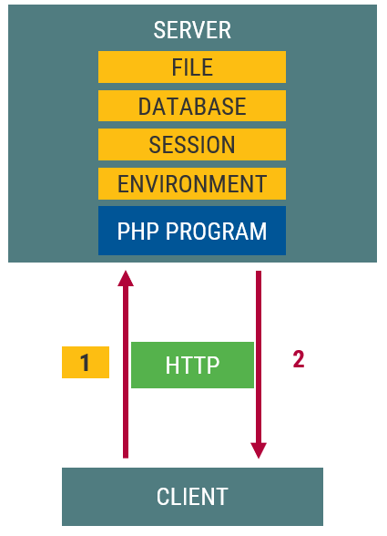
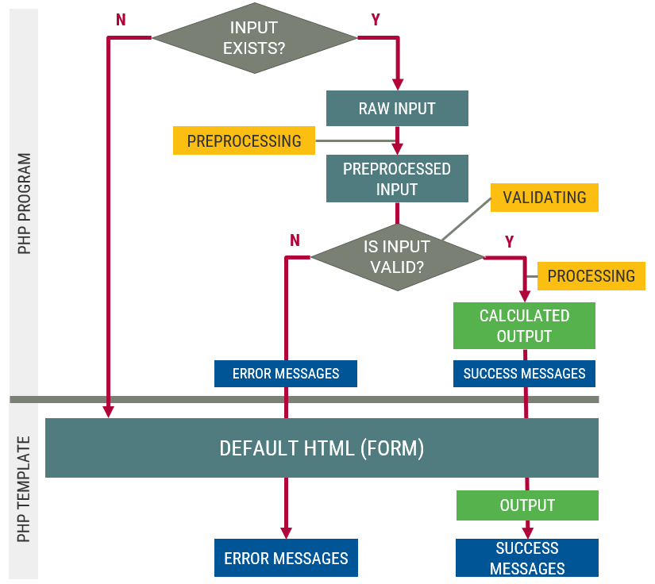
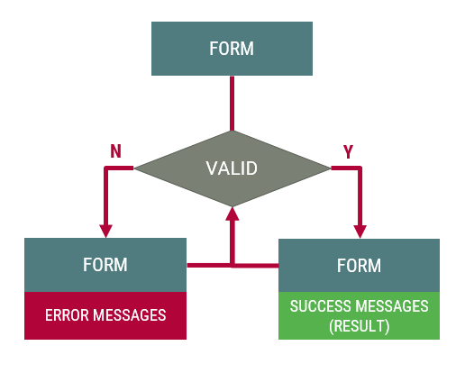

# Szerveroldali program bemeneti adatai

A program bemenetének lehetséges forrásai
- Kliens
- Környezet
- Fájl
- Munkamenet
- Adatbázis
- Másik szerver



## Kliensről érkező adatok


## Common Gateway Interface (CGI)

Azt határozza meg, hogy egy webszerver hogyan indíthat el egy programot és milyen módon cserél adatot vele.
- Indítás: program futtatása
- Adatok
  - környezeti változók
  - Standard I/O


## Kérés körülményei és HTTP fejlécek
- Kérés körülményei -> környezeti változók
  - HTTP kérés metódusa -> `REQUEST_METHOD`
  - kliens IP címe -> `REMOTE_ADDR`
  - üzenettörzs hossza -> `CONTENT_LENGTH`
- HTTP fejlécek -> környezeti változók
  - `HTTP_*`
  - Pl. `Accept` fejléc -> `HTTP_ACCEPT` környezeti változó

```cgi
[REMOTE_ADDR] => 188.142.184.197
[REMOTE_PORT] => 49323
[REQUEST_METHOD] => GET
[HTTP_ACCEPT] => text/html,application/xhtml+xml,application/xml;q=0.9,image/webp,*/*;q=0.8
[HTTP_ACCEPT_LANGUAGE] => hu-HU,hu;q=0.8,en-US;q=0.6,en;q=0.4
```

## URL
- Kérés URL-je (szabad paraméter: `<query>`)
- URL környezeti változók (fontos : `QUERY_STRING`)
  - `<scheme>` -> `SERVER_PROTOCOL`
  - `<host>` -> `SERVER_NAME`
  - `<port>` -> `SERVER_PORT`
  - `<path>` -> `SCRIPT_NAME`
  - `<query>` -> `QUERY_STRING`

## HTTP üzenettörzs
- HTTP üzenettörzs szabad paraméter
- Standard bemeneten jelenik meg
- Környezeti változó
  - `CONTENT_LENGTH`: adatmennyiség hossza

# Adatok az URL-ben

## Kérésindítási lehetőségek
- Cím (URL) beírása (`GET`)
- Linkre kattintás (`GET`)
- Űrlap elküldése (`GET`, `POST`)
- JavaScript (`GET`, `POST`, ...)
  - oldal újratöltés - `window.location` (`GET`)
  - űrlap elküldése - `submit()` metódus (`GET`, `POST`)
  - AJAX/fetch kérés (bármilyen HTTP metódus)

## Adatok az URL-ben
- A `?`-et követő név-érték párok sorozata
- `&` jellel elválasztva
  - `foo=1&bar=2`
- Szükség esetén "URL encoding"
  - `encodeURIComponent("Tom&Jerry");title="Tom%26Jerry"`
- A HTTP kérés nyitó sorában továbbítjuk

```cgi
GET /index.php?title=Tom%26Jerry HTTP/1.1
Host: webprog.inf.elte.hu
```

## Feldolgozás PHP-ban
- Környezeti változókon (`$_SERVER`) keresztül (CGI)
  - `$SERVER["QUERY_STRING"]`
- A `$_GET` szuperglobális változón keresztül
  - A PHP előre felpraseolja
  - asszociatív tömbként hozzáférhető
  - pl: `$_GET["title"]`

### Feldolgozás példa
```php
<?php
// index.php?title=Tom%26Jerry
// index.php?title=
// index.php
$title = $_GET["title"] ?? "I don't know";

?>
<h1>Title: <?= $title ?></h1>
```

# Űrlap elküldése

## Űrlap elküldése: A `<form>` elem

- Attribútumok
  - `action`: szervoldali erőforrás megjelelösése
  - `method`: HTTP metódus (`GET`, vagy `POST`)
  - `enctype`: a form-adatok kódolása a küldés során
- `enctype`
  - `application/x-www-form-urlencoded` (alapértelmezett)
  - `multipart/form-data` (fájlfeltöltés, csak `POST` esetén)
  - `text/plain` (levélküldés)

```html
<form method="get" action="index.php">
    <label for="title">
    <input type="text" name="title" id="title" />
    <button type="submit">Send </button>
</form>
```

## Űrlap elküldése
- Elküldés
  - a type `submit` gomb megnyomása
  - JavaScript: `form.submit()` meghívása
- Lépések
  - Elküldhető elemek kiválasztása
  - Kérési adatok összehasonlítása
  - Kérési adatok kódolása
  - A kódolt kérési adatok elküldése

### Elküldhető elemek kiválasztása
- van `name` attribútum
- nem `disabled`
- bejelölt checkbox
- bejelölt radio
- kiválasztott select

### Kérési adatok összehasonlítása
- Elküldhető formmelemekből `név=érték` párokat készít
- ezeket `&`-vel összefűzi
- `name=Győző&pwd=secret&check1=value1&check2=on`

### Kérési adatok kódolása
- ld. `enctype` attribútum
- `name=Gy%C5%91z%C5%91&pwd=secret&check1=value1&check2=on`
- -> Kérésszöveg (Query String)

### A kódolt kérési adatok elküldése
- **GET**
  - URL: `action-url` + `?` + `query-string`
  - URL mérete limitált a gyakorlatban 2kB
- **POST**
  - a HTTP kérés **üzenettörzs**ében utazik a kérésszöveg
  - sok adat küldhető

## `GET`/`POST` HTTP kérések

### `GET` HTTP kérés
```cgi
METÓDUS /<path>?<query> VERZIÓ
Host: <host>
FEJLÉC: ÉRTÉK
...
```

### `POST` HTTP kérés
```cgi
METÓDUS /<path>?<query> VERZIÓ
Host: <host>
FEJLÉC: ÉRTÉK
FEJLÉC: ÉRTÉK
FEJLÉC: ÉRTÉK

ÜZENETTEST
```

## Űrlap elküldése példa
### Űrlap
```html
<form action="http://host/page.php" method="post">
    <input type="text" name ="foo" value="bar">
    <input type="password" value="secret">
    <input type="hidden" name="password" value="secret">
    <input type="checkbox" name="check1" value="baz" checked>
    <input type="checkbox" name="check2" checked>
    <button type="submit">SUBMIT</button>
</form>
```
### Kérésszöveg (query string)
```cgi
foo=bar&password=secret&check1=baz&check2=on
```

## Űrlapelemek
- Szöveges elemek
  - `<input>` type: `text`, `password`, `hidden`
  - `<textarea>`
  - mindig elküldésre kerülnek
  - akár üres szöveggel is
  - `textrare`-nál vigyázni kell, minden elküldésre kerül, ami a `<textarea></textarea>` között van
- `checkbox`, `radio`
  - csak bejelölve kerül elküldésre
  - ha nincs `value` -> `on` érték
- `select`
  - csak kiválasztva kerül elküldésre
  - ha nincs `value` -> `option` szövege az érték
  - `size`>1 esetén ha nincs kiválasztva -> nem küldi el
  - `multiple` esetén -> ugyanazon névvel több név=érték pár (pl. `sel[]=foo&sel[]=bar`)
- `button`/`submit`
  - ha van neve -> elküldésre kerül az értékével (felirat)
- `file`
  - `enctype="multipart/form-data"`
  - `method="POST"`

## Űrlapadatok PHP-ban
- `method="get"` esetén ugyanúgy mint a link/URL esetén a `$_GET` tömbön keresztül
- `method="post"` esetén a `$_POST` szuperglobális változón (tömb) keresztül

## Szuperglobális tömbök
- `$_GET`: `QUERY_STRING`ben érkező név=érték pároknak megfelelő tömb, ahol a név a kulcs
- `$_POST`: a standard inputon érkező név=érték pároknak megfelelő tömb, ahol a név a kulcs
- `$_SERVER`: az összes környezeti változót tartalmazza
- `$_FILES`: a feltöltött fájlok helyét tartalmazza
- `$_COOKIES`: a kliensről érkező sütiket tartalmazza

# Űrlapfeldolgozás

Feldolgozás általános séma


## Példa
- Kör kerületének kiszámítása
- Bemenet: sugár
  - kötelező
- Kimenet: kerület
  - valid oldalon jelenjen meg

```html
<!doctype html>
<html>
    <head>
        <meta charset="utf-8">
        <title>Kerület</title>
    </head>
    <body>
        <p>Sugár = 10</p>
        <p> Kerület = 62.83></p>
    </body>
</html>
```

```php
<?php
declare(strict_types=1);
// debug
print_r($_GET);
print_r($_POST);

// business logic
function kerulet(float $sugar): float {
  return 2 * $sugar * pi();
}

// input
$sugar = (float)$_GET['sugar'];

// processing
$ker = kerulet($sugar);

// output
?>
<!doctype html>
<html>
  <head>
    <meta charset="utf-8">
    <title>Kerulet</title>
  </head>
  <body>
    <p>Sugár = <?= $sugar; ?></p>
    <p>Kerület = <?= $ker; ?></p>
  </body>
</html>
```

## Input hiánya és formátuma
- `kerulet.php` -> PHP hibák
- Kezelni kell az input hiányát
  - Alapértelmezett érték
  - Hibaüzenet
- Ha van input, akkor formátumellenőrzés

```php
// Segédfüggvény
function is_empty($input, $key) {
  return !(isset($input[$key]) && trim($input[$key]) !== '');
}

$hiba = '';
$sugar = null;
// Hiány esetén hibaüzenet
if (is_empty($_GET, 'sugar')) {
  $hiba = 'A sugár megadása kötelező';
} 
// Formátumellenőrzés
else if (!is_numeric($_GET['sugar'])) {
    $hiba = 'A sugár nem szám!';
}
else {
    $sugar = (float)$_GET['sugar'];
}

if ($hiba === '') {
  // processing
  $ker = kerulet($sugar);
}
```

## Általánosítás
- Folyamat
  - Adatok ellenőrzése
  - Beolvasás
  - Feldolgozás
  - Kiírás
- Több input esetén
  - bemeneti tömb (`$_GET`, `$_POST`)
  - típusos adatok tömbje (`$data`)
  - hibalista tömbje (`$errors`)
  - hibalista (HTML `<ul>`)

## PHP validáció: `*filter_*()`
`filter_var()` és `filter_var_array()`

```php
// is_numeric helyett
if (!filter_var($input['sugar'], FILTER_VALIDATE_FLOAT)) {
  $hiba = 'A sugár nem szám!';
}

// Összetettebb: szűrés és validálás
$email = filter_var($_POST['email'], FILTER_SANITIZE_EMAIL);
if (!filter_var($email, FILTER_VALIDATE_EMAIL)) {
  $hiba = "Nem jó e-mail formátum!"; 
}

// Opciók
filter_var($string, FILTER_VALIDATE_REGEXP, [
  "options"=>[
    "regexp"=>"/^M(.*)/",
  ],
]);
```

### PHP filterek
- FILTER_DEFAULT
- FILTER_VALIDATE_BOOLEAN
- FILTER_VALIDATE_EMAIL
- FILTER_VALIDATE_FLOAT
- FILTER_VALIDATE_INT
- FILTER_VALIDATE_IP
- FILTER_VALIDATE_MAC
- FILTEr_VALIDATE_REGEXP
- FILTER_VALIDATE_URL

## Általános feldolgozási logika
```php
$errors = [];
$input = $_GET;

// Ellenrőzés
if(validate($input, $data, $errors))
{
    // Beolvasás
    $sugar = $data['sugar'];

    // Feldolgozás
    $ker = kerulet($sugar);
}
else
{
    // Hiba
}
```

## Ellenőrző függvény
```php
function validate($input, &$data, &$errors) {
  // sugár vizsgálata
  $data['sugar'] = null;
  if (is_empty($input, 'sugar')) {
    $errors[] = 'A sugár megadása kötelező';
  } 
  else if (!is_numeric($input['sugar'])) {
    $errors[] = 'A sugár nem szám!';
  }
  else {
    $data['sugar'] = (float)$input['sugar'];
  } 
  
  return !(bool)$errors;
}
```

## Hibák kiírása
```php
<?php if($errors) : ?>
    <ul>
        <?php foreach($errors as $error) : ?>
            <li><?= $error ?></li>
        <?php endforeach ?>
    </ul>
<?php endif ?>
```

### Kerületes feladat megoldása
```php
<?php
// debug
print_r($_GET);
print_r($_POST);

// business logic
function kerulet(float $sugar): float {
  return 2 * $sugar * pi();
}

// helper function
function is_empty($input, $key) {
  return !(isset($input[$key]) && trim($input[$key]) !== '');
}
function validate($input, &$data, &$errors) {
  // sugár vizsgálata
  $data['sugar'] = null;
  if (is_empty($input, 'sugar')) {
    $errors[] = 'A sugár megadása kötelező';
  } 
  else if (!is_numeric($input['sugar'])) {
    $errors[] = 'A sugár nem szám!';
  }
  else {
    $data['sugar'] = (float)$input['sugar'];
  } 
  
  return !(bool)$errors;
}

// start
$errors = [];
$input = $_GET;

// check
if (validate($input, $data, $errors)) {
  // input
  $sugar = $data['sugar'];

  // processing
  $ker = kerulet($sugar);
}

// output
?>
<?php if ($errors) : ?>
  <ul>
    <?php foreach($errors as $error) : ?>
      <li><?= $error ?></li>
    <?php endforeach ?>
  </ul>
<?php else : ?>
  <p>Sugár = <?= $sugar ?></p>
  <p>Kerület = <?= $ker ?></p>
<?php endif ?>
```

## Űrlapok
- Kézi szerkesztés -> URL -> PHP helyett:
- Űrlap -> URL -> PHP
- kerulet.php?sugar=10



### Megoldás űrlappal
```html
<!doctype html>
<html>
  <head>
    <meta charset="utf-8">
    <title>Kerulet</title>
  </head>
  <body>
    <form action="kerulet.php" method="get">
      Radius: 
      <input type="text" name="sugar" value="10">
      <button>Calculate</button>
    </form>
  </body>
</html>
```

## Űrlap magának küldi az adatot
```php
<?php
$errors = [];
$input = $_GET;

if (count($_GET) !== 0) {
  // validate
  if (validate($input, $data, $errors)) {

    // input
    $sugar = $data['sugar'];

    // processing
    $ker = kerulet($sugar);
  }    
}

// output
?>
<body>
  <?php if ($errors) : ?>
    <ul>
      <?php foreach($errors as $error) : ?>
        <li><?= $error ?></li>
      <?php endforeach ?>
    </ul>
  <?php endif ?>

  <form action="" method="GET">
    Radius: 
    <input type="text" name="sugar" value="10">
    <button>Calculate</button>
  </form>

  <?php if (isset($ker)) : ?>
    <p>Sugár = <?= $sugar ?></p>
    <p>Kerület = <?= $ker ?></p>
  <?php endif ?>
</body>
```

## Űrlap állapottartása
Írjuk vissza a kitöltött adatokat, legalább hiba esetén

```html
<form action="circle.php> method="get">
    Sugár:
    <input típe="text" name="sugar" value="<?= $input['sugar'] ?? '' ?>">
    <input type="submit">
</form>
```

```html
<input name="input1" type="text" value="<?= $input1 ?? '' ?>">
<textarea name="input2"><?= $input2 ?></textarea>

<input name="input3" type="checkbox" value="value3"
  <?= $input3 === "value3" ? " checked" : "" ?>
>
<input name="input4" type="radio" value="value4"
  <?= $input4 === "value4" ? " checked" : "" ?>
>

<select name="input5">
  <option value="value51"
    <?= $input5 === "value51" ? " selected" : "" ?>
  >Value 3</option>
  <option value="value52"
    <?= $input5 === "value52" ? " selected" : "" ?>
  >Value 4</option>
</select>
```

# Kérésindítás JavaScript-tel

## Lehetőségek JavaScript-tel
Oldal újratöltése programozottan (`GET`)
```js
window.location = 'http://www.example.com?name=value';
```

Űrlap elküldése programozottan ('GET', 'POST')
```js
const form = document.querySelector('form');
form.submit();
```

AJAX/fetch kérés küldése a szervernek
```js
async function() {
    const formData = new FormData()
    formData.append('name', 'value')

    const response = fetch('http://www.example.com', {
        method: 'POST',
        body: formData
    })
}